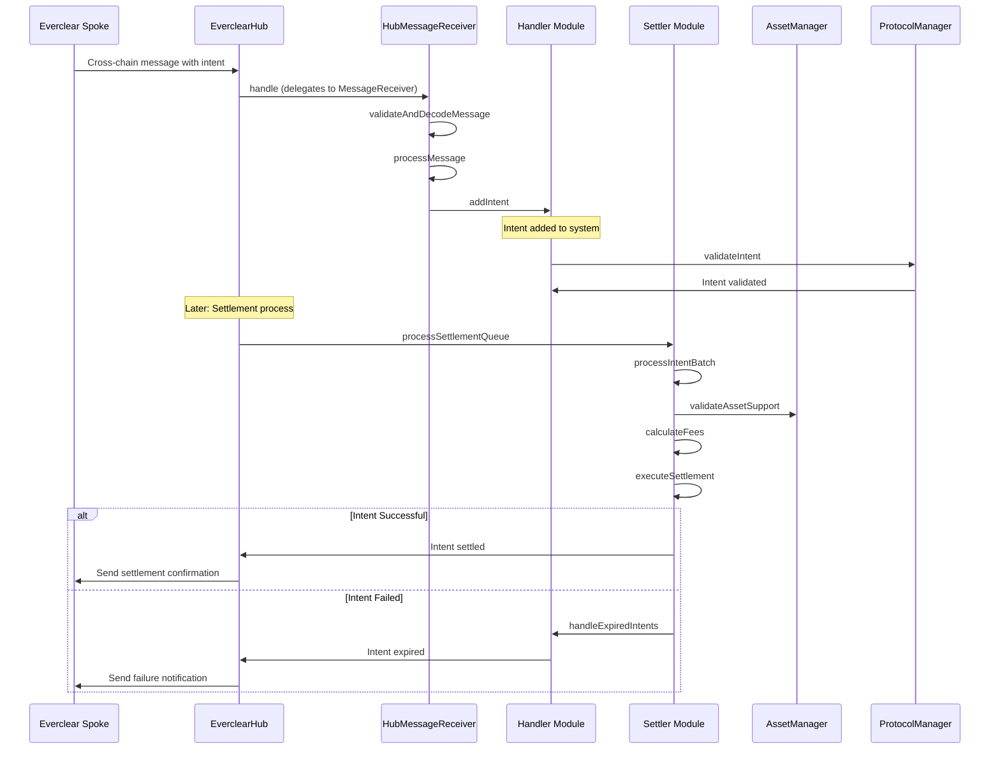
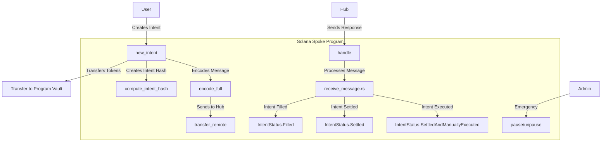

# Everclear Program Audit Report

<div align="center">

</div>

**Authors:**  
David P – david@fomo3d.app david@madshield.xyz  
BlueWolf – wolf@madshield.xyz<br>
JecikPo - je@madshield.xyz
## Table of Contents
1. [Introduction](#1-introduction)
2. [Findings & Recommendations](#2-findings--recommendations)
   - [2.1 Findings Summary](#21-findings-summary)
   - [2.2 Findings Description](#22-findings-description)
3. [Protocol Overview](#3-protocol-overview)
   - [3.1 Program Charts](#31-program-charts)
4. [Methodology](#4-methodology)
5. [Scope and Objectives](#5-scope-and-objectives)
6. [Conclusion](#6-conclusion)

## 1. Introduction

This audit focuses on the Everclear protocol, a cross-chain intent-based system developed by the Everclear team to enable seamless asset transfers and decentralized operations across multiple blockchain ecosystems. Designed with a hub-and-spoke architecture, Everclear leverages advanced cross-chain messaging—powered by Hyperlane integration and a intent management system to facilitate trustless, efficient, and secure interactions between disparate blockchain networks. The protocol’s Solana spoke, a key component of this audit, represents a chain-specific implementation for Solana’s architecture.

The purpose of this audit, is to evaluate the security, reliability, and operational integrity of the Everclear protocol, with a particular emphasis on the Solana spoke implementation. This report details our findings, including critical and low-severity issues uncovered during the process. In collaboration with the Everclear team, we aimed to not only uncover potential risks but also contribute to the protocol’s long-term resilience and success in the evolving landscape of decentralized finance.


## 2. Findings & Recommendations
Our severity classification system adheres to the criteria outlined here.

| Severity Level | Exploitability | Potential Impact | Examples |
|----------------|----------------|------------------|-----------|
| 🔴 Critical | Low to moderate difficulty, 3rd-party attacker | Irreparable financial harm | Direct theft of funds, permanent freezing of tokens/NFTs |
| 🔶 High | High difficulty, external attacker or specific user interactions | Recoverable financial harm | Temporary freezing of assets |
| 🟡 Medium | Unexpected behavior, potential for misuse | Limited to no financial harm, non-critical disruption | Escalation of non-sensitive privilege, program malfunctions |
| 🔵 Low | Implementation variance, uncommon scenarios | Zero financial implications, minor inconvenience | Program crashes in rare situations |
| ℹ️ Informational | N/A | Recommendations for improvement | Design enhancements, best practices |

### 2.1. Findings Summary

| Finding | Description | Severity Level |
|---------|-------------|----------------|
| [Everclear_01]| Missing Vault Account Validation Allows Tokens to be Redirected | 🔴 Critical |
| [Everclear_02]| Incorrect Decimal Conversion | 🔴 Critical  |
| [Everclear_03]| Missing Token Account Owner Verification | 🔵 Low |

### 2.2. Findings Description

#### Everclear_01 Missing Vault Account Validation Allows Tokens to be Redirected [Critical]
The Everclear Solana Spoke program includes the permissionless new_intent instruction, enabling a user to deposit tokens on this spoke and create an intent that specifies the expected amount to be received on another spoke.

There is a vulnerability in the `new_intent` instruction that allows users to redirect tokens to arbitrary accounts instead of the program's vault, while still creating valid intents.
In [`new_intent.rs`](https://github.com/everclearorg/monorepo/tree/test/spoke_in_rust/packages/contracts/solana-spoke/programs/everclear_spoke/src/instructions), the program transfers tokens from a user's account to what should be the program's vault:
```rust
// Transfer from user's token account -> program's vault
let cpi_accounts = Transfer {
    from: ctx.accounts.user_token_account.to_account_info(),
    to: ctx.accounts.program_vault_account.to_account_info(),
    authority: ctx.accounts.authority.to_account_info(),
};
let cpi_ctx = CpiContext::new(ctx.accounts.token_program.to_account_info(), cpi_accounts);
token::transfer(cpi_ctx, amount)?;
```
However, the account validation in the `NewIntent` context does not check the owner of this account. 
```rust
#[derive(Accounts)]
pub struct NewIntent<'info> {
    // ... other accounts ...
    pub mint: Account<'info, Mint>,
    #[account(mut, constraint = user_token_account.mint == mint.key())]
    pub user_token_account: Account<'info, TokenAccount>,
    #[account(mut, constraint = program_vault_account.mint == mint.key())]
    pub program_vault_account: Account<'info, TokenAccount>,
    // ... other accounts ...
}
```
There is no constraint that forces the `program_vault_account` to be owned by the program or to be a program derived owned account. We verified this issue with a test we set the `program_vault_account` to a user owned ATA: 
```rust
// From the test file
const vault = anchor.web3.Keypair.generate();
const programVaultAccount = await token.createAssociatedTokenAccount(
  connection,
  user, // fee payer
  mintPubkey, // mint
  vault.publicKey, // owner
);
```
This vulnerability allows a user to:
- Create a legitimate transaction with their own token account as `user_token_account`.
- Specify any token account (*most likely a user owned account*) with the matching mint as the `program_vault_account`.
- Transfer their tokens to this arbitrary account instead of the program's vault.
- Still have a valid intent created in the protocol
This lack of validation completely bypasses the program's control over incoming tokens.

To fix this issue, the following code was added:
```rust
    let vault_authority_seeds: &[&[u8]] = vault_authority_pda_seeds!(state.vault_authority_bump);
    let vault_authority = Pubkey::create_program_address(vault_authority_seeds, ctx.program_id)
        .map_err(|_| error!(SpokeError::InvalidArgument))?;
    let vault_ata = associated_token::get_associated_token_address_with_program_id(
        &vault_authority,
        &ctx.accounts.mint.key(),
        ctx.accounts.token_program.key,
    );
    require!(
        ctx.accounts.program_vault_account.mint == ctx.accounts.mint.key()
            && ctx.accounts.program_vault_account.owner == vault_authority
            && ctx.accounts.program_vault_account.key() == vault_ata,
        SpokeError::InvalidVaultAccount
    );
```

This vulnerability allows a malicious user creation of intents without depositing assets, it effectively allows stealing of funds from the other spokes of the system on other chains. 

#### Everclear_02 Incorrect Decimal Conversion [Critical]
The `handle` instruction, as the name suggests, is used to handle the incoming settlements from the Everclear hub. The amount coming in from the settlement message is always scaled to 18 decimals, and in the spoke program it is de-scaled (or normalized) to the expected decimals of the transferred token. There's a conversion issue in the way how the normalization function is called. The code attempts to normalize the amount from the settlement, but it incorrectly handles the conversion between different decimal precisions.
```rust
let amount = normalize_decimals(
    settlement.amount.low_u64(),  //  (18 decimals)
    minted_decimals,             // 6 for USDC
    DEFAULT_NORMALIZED_DECIMALS,  // 18
)?;
)?;
```

This is not right when receiving a message, as the `target_decimals` in the `normalize_decimals` function has to be the decimals of the token which in this case is called `minted_decimals` and the source decimals are 18 or `DEFAULT_NORMALIZED_DECIMALS`.

To fix this issue, the order of the argument passed are swapped as follows:
```rust
let mint_account = Account::<Mint>::try_from(mint_info)?;
let minted_decimals = mint_account.decimals;
let amount = normalize_decimals(
    settlement.amount.low_u64(),
    DEFAULT_NORMALIZED_DECIMALS,
    minted_decimals,
)?;
if amount == 0 {
    return Ok(None);
}
```

As this vulnerability would allow a malicious user to inflate artificually the amount of receiving tokens, it could lead to the following:
- draining of the spoke's entire vault.
- settlement failures, as there would not be enough tokens in the vault to satisfy the inflated amount.

And as such is a critical issue.

#### Everclear_03 Missing Token Account Owner Verification [Low]
The `new_intent` instruction in the does not verify that the `user_token_account` belongs to the signing `authority`, creating a vulnerability where a user with delegated access to someone else's token account could create intents, or if additional signers are present to the instruction such as in the case of gasless or multi-sig transactions. 

In `new_intent.rs`, the account constraints only verify that the token account has the correct mint:
```rust
#[derive(Accounts)]
pub struct NewIntent<'info> {
    // ... other accounts ...
    #[account(mut)]
    pub authority: Signer<'info>,
    
    pub mint: Account<'info, Mint>,
    #[account(mut, constraint = user_token_account.mint == mint.key())]
    pub user_token_account: Account<'info, TokenAccount>,
    // ... other accounts ...
}
```
The issue is that there is no constraint checking that `user_token_account.owner == authority.key()`. This missing constraint means the program doesn't verify that the token account is owned by the signing `authority`.

While the SPL Token program verifies that the account owner is a signer of the transaction, but it doesn’t guarantee that this owner is the person who should actually be responsible for authorizing the spending. In other words, it checks the signer’s identity matches the account, not whether they’re the intended person to approve that specific transfer.

To fix this issue, the following changes have been made :
```rust
    #[account(
        mut,
        token::mint = mint,
        token::authority = authority,
        token::token_program = token_program,
    )]
    pub user_token_account: Account<'info, TokenAccount>,
```


## 3. Protocol Overview
Everclear emerges as a sophisticated cross-chain protocol designed to facilitate seamless asset transfers and intent-based operations across multiple blockchain ecosystems. At its core, the protocol implements a hub-and-spoke architecture that enables secure, efficient, and trustless cross-chain communication and asset management.

The Everclear protocol is built around a "Chimera" architecture that consists of three primary components:
- EverclearHub: The central coordination layer that manages cross-chain operations, settlement processes, and protocol governance. The hub serves as the backbone of the protocol, orchestrating interactions between different blockchain networks.
- Spoke Contracts: Chain-specific implementations that handle local operations on their respective blockchains. These include the Solana spoke, which is specifically designed to integrate with Solana's unique architecture and programming model.
- Hyperlane Integration: The protocol leverages Hyperlane's messaging infrastructure to enable secure cross-chain communication, allowing for reliable message passing between the hub and various spokes.

At the heart of Everclear is an intent-based system that allows users to express their desired outcomes without specifying the exact execution path. The protocol processes these intents through a sophisticated pipeline that includes validation, routing, settlement, and execution phases, ensuring optimal outcomes for users while maintaining security and efficiency.

### 3.1 Program Charts

#### Protocol Architecture Flow



This sequence diagram depicts the end-to-end process of how the Everclear hub handles an intent received from a spoke contract. The flow begins with the hub receiving a cross-chain message containing the intent data, which is then delegated to the `HubMessageReceiver` module for validation and processing. The intent is validated by the `ProtocolManager` before being added to the system. The diagram then shows the settlement process, where the `Settler` module processes the intent batch, validates asset support through the `AssetManager`, calculates fees, and executes the settlement. Finally, it illustrates the two possible outcomes: successful settlement with confirmation sent back to the spoke, or intent failure handling through the `handleExpiredIntents` function.


#### Solana Spoke Flow

This diagram illustrates the lifecycle of an intent within the Solana spoke of the Everclear protocol. It shows how a user initiates an intent through the `new_intent` function, which transfers tokens to the program vault, computes a unique intent hash, and encodes the message for cross-chain transmission to the hub. The diagram also depicts how the Solana spoke handles incoming messages from the hub through the `handle` function, which processes different intent statuses (Filled, Settled, or SettledAndManuallyExecuted). Additionally, it shows the administrative capability to pause or unpause the program in emergency situations.


## 4. Methodology

Given that Everclear is a cross-chain intent protocol managing complex message passing, settlement processes, and cross-chain asset transfers, we employed a comprehensive and systematic methodology to test the protocol's security, reliability, and cross-chain communication mechanisms. Our primary approach involved analyzing the hub-and-spoke architecture, intent management system, and cross-chain message validation to verify the protocol's security and operational integrity.

This methodology allowed us to observe how the protocol would operate in real-world cross-chain scenarios, especially focusing on the message validation implementation and intent settlement systems. This security-focused approach was essential for evaluating the safety and reliability of the protocol's core components, particularly the Hyperlane integration and intent management across multiple blockchains.

We conducted detailed code analysis of cross-chain message processing and intent settlement functions. This included reviewing the implementation of message validation in the `validateAndDecodeMessage` function, intent status tracking through the `IntentStatus` enum, and the security of settlement processing in the `processSettlementQueue` and `executeSettlement` functions across different cross-chain scenarios.

Special attention was given to the Solana spoke implementation, analyzing how the `new_intent`, `handle`, and cross-chain message processing functions operate within Solana's unique programming model. We evaluated the robustness of token transfers to the program vault, intent hash computation via `compute_intent_hash`, and cross-chain message encoding through the `encode_full` and `transfer_remote` functions. During this phase, we encountered significant testing challenges with Anchor, Solana’s development framework. Initial difficulties arose in effectively simulating and validating the Solana-specific components, particularly around Anchor’s usage for program deployment and testing.

To address these issues, we collaborated closely with the development team to refine our testing framework. With their support, we adapted the framework to better suit Everclear’s cross-chain requirements and conducted extensive testing of the program once it was fully operational. This rigorous process ensured we could confidently verify the Solana spoke’s functionality, overcoming the initial hurdles and strengthening our overall methodology.

Our methodology also included assessment of the protocol's governance and emergency mechanisms, such as the pause/unpause functionality and role-based access control systems implemented across both the hub and spoke components, ensuring the protocol can respond effectively to potential security incidents.

## 5. Scope and Objectives

The primary objectives of the audit are defined as:

- Minimizing the possible presence of any critical vulnerabilities in the program. This would include detailed examination of the code and edge case scrutinization to find as many vulnerabilities. 


- 2-way communication during the audit process. This included for OShield to reach a perfect understanding of the design of the system and the goals of the team.

- Provide clear and thorough explanations of all vulnerabilities discovered during the process with potential suggestions and recommendations for fixes and code improvements. 

- Clear attention to the documentation of the vulnerabilities with an eventual publication of a comprehensive audit report to the public audience for all stakeholders to understand the security status of the programs. 

### Repository Information

| Item | Details |
|------|---------|
| Repository URL | https://github.com/everclearorg/monorepo/tree/test/spoke_in_rust/packages/contracts/solana-spoke |
| Commit (start of audit) | 7ed44cd2e9e742528d6c625a065b97c0d0985efd |
| Commit (end of audit) | TBD |

## 6. Conclusion
OShield conducted an extensive audit of Everclear, utilizing a hands-on methodology that prioritizes a detailed, immersive review of the program. Our team's approach is rooted in active collaboration, working closely with each unique project to identify potential security risks and mitigate vulnerabilities effectively.
OShield's dedication to advancing auditing techniques is clear throughout our process. We consistently apply innovative strategies, allowing us to analyze the code at a granular level, simulate real-world scenarios, and uncover potential risks that traditional audits might miss.

Oshield identified 2 critical-severity and 1 low-severity. Through active collaboration with the development team, all critical and low-risk issues were resolved. The development team's responsive approach to addressing findings and commitment to implementing recommended fixes indicates a strong security-first mindset.
Our recommendations focus on strengthening the codebase to enhance long-term security and resilience. OShield remains committed to setting new standards in smart contract auditing.
