# HYPERION DEX-V3 Audit Report

<div align="center">

</div>

**Authors:**  
- David P – david@oshield.io  
- BlueWolf – wolf@oshield.io
- Mikb – mika@oshield.io

## Executive Summary

OShield performed a thorough audit of the Hyperfluid DEX-V3 protocol, a decentralized exchange on the Aptos blockchain featuring a hybrid Orderbook-AMM model. The audit identified six vulnerabilities: one high-severity issue ([HYPERION-H1](#HYPERION-h1-price-limit-bypass-and-tick-desynchronization-in-swap-execution-in-pool_v3move): Price Limit Bypass and Tick Desynchronization in `pool_v3.move`, two medium-severity issues [HYPERION-M1](#HYPERION-m1-token-type-mismatch-in-pool-creation-in-router_v3move): Token Type Mismatch in `router_v3.move`), ([HYPERION-M2](#HYPERION-m2-seconds-outside-not-initialized-on-creation-in-tickmove): Seconds Outside Not Initialized in `tick.move`), and two informational issues ([HYPERION-I1](#HYPERION-i1-unnecessary-tick-rounding-in-pool-creation-in-pool_v3move), [I2](#HYPERION-i2-missing-emission-verification-in-tickmove). The high-severity issue, which could lead to recoverable financial harm and affect user intent, was swiftly addressed through collaboration with the Hyperion development team, reflecting their proactive security stance.

The audit employed a robust methodology, including code review, mathematical verification, threat modeling, vulnerability testing, and architectural analysis, with a focus on economic risks and edge cases. Formal verification leveraged the Aptos Move prover, with custom scripts to resolve type c onversion challenges in the Move-to-Boogie transpilation process. Key proofs validated critical functionalities such as tick crossing, fee growth updates, liquidity management, and reward system operations, ensuring protocol reliability. OShield’s recommendations aim to bolster long-term security and resilience, solidifying Hyperion DEX-V3’s role as a dependable component in the Aptos ecosystem.

## Table of Contents
- [HYPERION DEX-V3 Audit Report](#HYPERION-dex-v3-audit-report)
	- [Table of Contents](#table-of-contents)
	- [1. Introduction](#1-introduction)
	- [2. Findings \& Recommendations](#2-findings--recommendations)
		- [2.1. Findings Summary](#21-findings-summary)
		- [2.2. Findings Description](#22-findings-description)
			- [HYPERION-H1: Price Limit Bypass and Tick Desynchronization in Swap Execution in `pool_v3.move`](#HYPERION-h1-price-limit-bypass-and-tick-desynchronization-in-swap-execution-in-pool_v3move)
			- [HYPERION-M1: Token Type Mismatch in Pool Creation in `router_v3.move`](#HYPERION-m1-token-type-mismatch-in-pool-creation-in-router_v3move)
			- [HYPERION-M2: Seconds Outside Not Initialized on Creation in `tick.move`](#HYPERION-m2-seconds-outside-not-initialized-on-creation-in-tickmove)
			- [HYPERION-I1: Unnecessary Tick Rounding in Pool Creation in `pool_v3.move`](#HYPERION-i1-unnecessary-tick-rounding-in-pool-creation-in-pool_v3move)
			- [HYPERION-I2: Missing Emission Verification in `tick.move`](#HYPERION-i2-missing-emission-verification-in-tickmove)
	- [3. Protocol Overview](#3-protocol-overview)
		- [3.1 Program Charts](#31-program-charts)
			- [DEX-V3 Structure](#dex-v3-structure)
			- [Swap Execution](#swap-execution)
	- [4. Methodology](#4-methodology)
 	- [5 Formal Verification](#5-formal-verification)
	- [6. Scope and Objectives](#6-scope-and-objectives)
		- [Repository Information](#repository-information)


## 1. Introduction

This audit focuses on Hyperfluid, a fully on-chain hybrid Orderbook-AMM DEX built natively for Aptos. Hyperion (https://hyperion.xyz/) leverages Aptos's throughput and minimal latency for trading. The protocol implements an advanced automated market maker (AMM) system with concentrated liquidity positions, tick-based price ranges, and multiple fee tiers.

This audit included a thorough review of the protocol's smart contract code with particular attention to economic vulnerabilities, mathematical accuracy, and security implications of token interactions. Hyperfluid is an important infrastructure component for the Aptos ecosystem, and ensuring their security and correctness is critical for both the protocol and its users.

## 2. Findings & Recommendations
Our severity classification system adheres to the criteria outlined here.

| Severity Level | Exploitability | Potential Impact | Examples |
|----------------|----------------|------------------|-----------|
| 🔴 Critical | Low to moderate difficulty, 3rd-party attacker | Irreparable financial harm | Direct theft of funds, permanent freezing of tokens/NFTs |
| 🟠 High | High difficulty, external attacker or specific user interactions | Recoverable financial harm | Temporary freezing of assets |
| 🟡 Medium | Unexpected behavior, potential for misuse | Limited to no financial harm, non-critical disruption | Escalation of non-sensitive privilege, program malfunctions |
| 🔵 Low | Implementation variance, uncommon scenarios | Zero financial implications, minor inconvenience | Program crashes in rare situations |
| ℹ️ Informational | N/A | Recommendations for improvement | Design enhancements, best practices |

### 2.1. Findings Summary
<br>
<br>
<br>
| Finding | Description | Severity Level |
|---------|-------------|----------------|
| [HYPERION-H1]| Price Limit Bypass and Tick Desynchronization in Swap Execution in `pool_v3.move` | 🟠 High |
| [HYPERION-M1]| Token Type Mismatch in Pool Creation in `router_v3.move` | 🟡 Medium |
| [HYPERION-M2]| Seconds Outside Not Initialized on Creation in `tick.move` | 🟡 Medium |
| [HYPERION-I1]| Unnecessary Tick Rounding in Pool Creation in `pool_v3.move` | ℹ️ Informational |
| [HYPERION-I2]| Missing Emission Verification in `tick.move` | ℹ️ Informational |

### 2.2. Findings Description

#### HYPERION-H1: Price Limit Bypass and Tick Desynchronization in Swap Execution in `pool_v3.move`

##### Description

In the [`pool_v3.move`](https://github.com/hyperionxyz/dex-v3/tree/main/sources/v3/pool_v3.move) module, there is an implementation issues that creates a systemic risk affecting trade execution precision, price reporting, and slippage protection. This finding is detailed code review, and affect every swap that uses price limits, placing user funds at risk.

In the swap computation, the implementation fails to implement price limit validation logic. There should be logic in the code to determine the closest of the limit_price and the next_tick price up to which the swap will continue to execute, similarly to Uniswap V3's standard behavior as follows:

```solidity
(state.sqrtPriceX96, step.amountIn, step.amountOut, step.feeAmount) = SwapMath.computeSwapStep(
    state.sqrtPriceX96,
    (zeroForOne ? step.sqrtPriceNextX96 < sqrtPriceLimitX96 : step.sqrtPriceNextX96 > sqrtPriceLimitX96)
        ? sqrtPriceLimitX96  // Cap at limit if next tick would cross it
        : step.sqrtPriceNextX96,
    state.liquidity,
    state.amountSpecifiedRemaining,
    fee
);
```

The missing logic should determine the target price by comparing the next tick price with the user's specified limit:

- **For token0 to token1 swaps (a2b = true)**: The target price should be the maximum of sqrt_price_next and sqrt_price_limit, ensuring the price does not drop below the limit
- **For token1 to token0 swaps (a2b = false)**: The target price should be the minimum of sqrt_price_next and sqrt_price_limit, ensuring the price does not rise above the limit

##### Impact

This finding is classified as High due to the following factors:
- **Potential Price Limit Violations**: When swaps cross tick boundaries that exceed the specified price limit, execution may continue beyond the intended threshold.
- **Slippage Protection Concerns**: The primary mechanism for controlling execution boundaries may not function as expected in certain market conditions.
- **Undefined Swap Behaviour**: The lack of consistent target price calculation can cause swaps to respect the  `sqrt_price_limit` input only when it is exactly equal to the next tick's price and to ignore it otherwise, resulting in an undefined swap charachteresitcs.

##### Implemented Solution

To address this vulnerability, the developers implemented a fix that ensures proper enforcement of the specified price limit during swap execution. The updated code introduces a target_price that caps the next square root price (sqrt_price_next) at the sqrt_price_limit based on the swap direction (a2b):

```move
module dex_contract::pool_v3 {
    use std::signer;
    use std::vector;
  + use aptos_std::math128;
    use std::string::{String};
    use aptos_std::timestamp;
    use aptos_std::comparator;
            [...]    
		tick_next = tick_math::max_tick();
            };
            let sqrt_price_next = tick_math::get_sqrt_price_at_tick(tick_next);
  +          let target_price = if(a2b) {
  +              math128::max(sqrt_price_next, sqrt_price_limit)
  +          } else {
  +              math128::min(sqrt_price_next, sqrt_price_limit)
  +          };

            let (amount_in, amount_out, next_sqrt_price, fee_amount) =
                swap_math::compute_swap_step(
                    state.sqrt_price,
REMOVED             sqrt_price_next,
  +                  target_price,
                    state.liquidity,
                    state.amount_specified_remaining,
                    pool_mut.fee_rate,

```
This change ensures that the target price is properly calculated by comparing the next tick price with the user's limit, preventing execution beyond the specified boundaries.

- [View File ](https://github.com/hyperionxyz/dex-v3/blob/3cb6854e54ee50eab707fb3cc8d8fe0e4e8e4008/sources/v3/pool_v3.move#L1921-L1936)
- [View Commit ](https://github.com/hyperionxyz/dex-v3/commit/3cb6854e54ee50eab707fb3cc8d8fe0e4e8e4008#diff-4df44619a3e80d7da552eb8697dcc578837256cd3c46b1842a8213584601ca28R1921)
 
#### HYPERION-M1: Token Type Mismatch in Pool Creation in `router_v3.move`

##### Description

In the [`router_v3.move`](https://github.com/HYPERIONxyz/dex-v3/tree/main/sources/v3/router_v3.move) module, the `create_pool_both_coins` function is designed to create a pool between two different coin types (`CoinType1` and `CoinType2`), but due to a coding error, it's using the same coin type for both sides of the pool.

The error occurs in the function implementation:

```move
// router_v3.move
public entry fun create_pool_both_coins<CoinType1, CoinType2>(
    fee_tier: u8,
    tick: u32,
) {
    create_pool(
        coin::paired_metadata<CoinType1>().extract(),
        coin::paired_metadata<CoinType1>().extract(), // Using CoinType1 instead of CoinType2
        fee_tier,
        tick,
    );
}
```

The second parameter incorrectly uses `CoinType1` again, instead of using `CoinType2`. This creates an error in the type system, attempting to create a pool with the same token type on both sides, violating the DEX principle requiring two different tokens to form a trading pair.

##### Impact

1. The `create_pool_both_coins` function is broken
2. Attempts to use this function will fail with a type error

##### Implemented Solution

To address this vulnerability, the developers implemented a fix that ensures proper enforcement of the right token, setting the second parameter in the `create_pool` call to use `CoinType2` instead of repeating `CoinType1`:

```diff
// In router_v3.move
public entry fun create_pool_both_coins<CoinType1, CoinType2>(
    fee_tier: u8,
    tick: u32,
) {
    create_pool(
        coin::paired_metadata<CoinType1>().extract(),
-       coin::paired_metadata<CoinType1>().extract(),
+       coin::paired_metadata<CoinType2>().extract(),
        fee_tier,
        tick,
    );
}
```
- [View File ](https://github.com/hyperionxyz/dex-v3/blob/a2301eb1a8833b4f72600cf12b61ef2c7dc1e69a/sources/v3/router_v3.move#L52-L62)
- [View Commit ](https://github.com/hyperionxyz/dex-v3/commit/a2301eb1a8833b4f72600cf12b61ef2c7dc1e69a)


#### HYPERION-M2: Seconds Outside Not Initialized on Creation in `tick.move`

##### Description

In the [`tick.move`](https://github.com/hyperionxyz/dex-v3/tree/main/sources/v3/tick.move) module, the `seconds_outside` field is initialized for new ticks. This field is critical for time-based calculations that affect rewards and fee distributions.

The problem begins in the `empty()` function, which initializes a new `TickInfo` structure with `seconds_outside` set to 0:

```move
// tick.move
public fun empty(): TickInfo {
    TickInfo {
        // ... other fields ...
        seconds_outside: 0,
        // ... other fields ...
    }
}
```

However, this field is never updated to the current timestamp during initialization. Later, when the `cross` function is called during a swap, it performs this calculation:

```move
// tick.move
info.seconds_outside = time - info.seconds_outside;
```

When `seconds_outside` is initialized to 0, this calculation will set `seconds_outside` equal to the current time (`time`), which overestimates the actual time delta.

This creates inconsistent time tracking where:

- When a tick is initialized at T1 = 1000: `seconds_outside = 0`
- When that tick is crossed at T2 = 2000: `seconds_outside = 2000 - 0 = 2000`

The correct behavior should be:
- Initialize `seconds_outside = T1 = 1000` at creation
- When crossed: `seconds_outside = 2000 - 1000 = 1000`

##### Impact

1. Time-weighted fees are calculated incorrectly
2. Rewards based on time metrics are overestimated
3. Positions that cross tick boundaries receive inflated time accumulations

##### Implemented Solution

To address this vulnerability, the team decided that this issue will be fixed when implemeting the oracle.


#### HYPERION-I1: Unnecessary Tick Rounding in Pool Creation in `pool_v3.move`

##### Description

In the `create_pool` function of [`pool_v3.move`](https://github.com/hyperionxyz/dex-v3/tree/main/sources/v3/pool_v3.move), when token order is reversed, the code unnecessarily rounds the tick to align with tick spacing:

```move
    public fun create_pool(
        token_a: Object<Metadata>,
        token_b: Object<Metadata>,
        fee_tier: u8,
        tick: u32,
    ): Object<LiquidityPoolV3> acquires LiquidityPoolConfigsV3 {
        if (!is_sorted(token_a, token_b)) {
            return create_pool(
                token_b,
                token_a,
                fee_tier,
                i32::as_u32(i32::round_to_spacing(
                    i32::mul(i32::from_u32(tick), i32::neg_from(1)),
                    TICK_SPACING_VEC[(fee_tier as u64)],
                    false
                ))
            );
        };

	// rest of the code
```

This is overly restrictive as pool initialization ticks don't need to be aligned with tick spacing (unlike position ticks). The main requirement is that `pool.tick` correctly corresponds to `pool.sqrt_price`, which is already ensured through the code.

Notably, while the `fee_tier` parameter should be validated to be within the range 0-3 to prevent out-of-bounds array access, this would only cause transaction failure rather than security issues.

##### Impact

The current implementation unnecessarily constrains the initial price setting when token order is reversed by forcing tick alignment with tick spacing, even though this alignment is only required for positions.

##### Recommendation

```move
if (!is_sorted(token_a, token_b)) {
    return create_pool(
        token_b,
        token_a,
        fee_tier,
        i32::as_u32(i32::mul(i32::from_u32(tick), i32::neg_from(1)))
    );
};
```

By removing the call to `round_to_spacing()` and directly negating the tick, the code would preserve exact price symmetry when token order is reversed, providing maximum flexibility for initial price setting while maintaining the critical relationship between `pool.tick` and `pool.sqrt_price`.

#### HYPERION-I2: Missing Emission Verification in `tick.move`

##### Description

In the [`tick.move`](https://github.com/hyperionxyz/dex-v3/tree/main/sources/v3/tick.move) module, the manipulation of `emissions_per_liquidity_incentive_outside` lacks proper safeguards to ensure consistent tracking when emissions are reordered or modified.

The issue relates to how emissions are tracked and indexed in the global array versus individual ticks:

1. If the order of emissions in the global `emissions_per_liquidity_global` array can be changed, this change is not properly tracked in individual ticks
2. When tick information is updated during crossing, there is no mechanism to maintain the association between specific reward types and their positions in the array

##### Impact

1. Inconsistent reward calculations across different ticks and positions

##### Recommendation

Implement stronger verification and tracking for emissions:

```diff
// In relevant emission tracking structures
+ struct EmissionInfo {
+     emission_type_id: ID, // Unique identifier for the emission type
+     emissions_per_liquidity: u128
+ }

// Replace simple vector with a vector of typed emissions
- emissions_per_liquidity_incentive_outside: vector<u128>,
+ emissions_per_liquidity_incentive_outside: vector<EmissionInfo>,
```

If no change is made in the code, keep this in mind for DevOps.


## 3. Protocol Overview

The DEX-V3 protocol is a decentralized exchange implementation on the Aptos blockchain that allows users to trade tokens, provide liquidity, and earn rewards. It employs a concentrated liquidity model similar to Uniswap V3, where liquidity providers can specify price ranges for their positions.

Key components include:

- **Liquidity Pools**: Manages the exchange of token pairs with configurable fee tiers
- **Positions**: Represents user liquidity within specific tick ranges
- **Tick System**: Controls the price increments and liquidity distribution
- **Router**: Handles user interactions including swaps and liquidity management
- **Rewarder**: Distributes incentives to liquidity providers

### 3.1 Program Charts
#### DEX-V3 Structure

This diagram represents the core architecture of the DEX-V3 protocol. Components are organized by functionality with relationships showing dependencies. 

```mermaid
classDiagram
direction TB
    class LiquidityPoolConfigsV3 {
        +all_pools: SmartVector[Object[LiquidityPoolV3]]
        +is_paused: bool
        +fee_manager: address
        +pauser: address
        +pending_fee_manager: address
        +pending_pauser: address
        +tick_spacing_list: vector[u64]
    }

    class LiquidityPoolV3 {
        +token_a_liquidity: Object[FungibleStore]
        +token_b_liquidity: Object[FungibleStore]
        +token_a_fee: Object[FungibleStore]
        +token_b_fee: Object[FungibleStore]
        +sqrt_price: u128
        +liquidity: u128
        +tick: I32
        +observation_index: u64
        +observation_cardinality: u64
        +observation_cardinality_next: u64
        +fee_rate: u64
        +fee_protocol: u64
        +unlocked: bool
        +fee_growth_global_a: u128
        +fee_growth_global_b: u128
        +seconds_per_liquidity_oracle: u128
        +seconds_per_liquidity_incentive: u128
        +position_blacklist: PositionBlackList
        +last_update_timestamp: u64
        +tick_info: SmartTable[I32, TickInfo]
        +tick_map: BitMap
        +tick_spacing: u32
        +protocol_fees: ProtocolFees
        +lp_token_refs: LPTokenRefs
        +max_liquidity_per_tick: u128
        +rewarder_manager: RewarderManager
    }

    class TickInfo {
        +liquidity_gross: u128
        +liquidity_net: I128
        +fee_growth_outside_a: u128
        +fee_growth_outside_b: u128
        +tick_cumulative_outside: u64
        +seconds_per_liquidity_oracle_outside: u128
        +seconds_per_liquidity_incentive_outside: u128
        +emissions_per_liquidity_incentive_outside: vector[u128]
        +seconds_outside: u64
        +initialized: bool
    }

    class BitMap {
        +map: Table[I32, u256]
        +new()
        +flip_tick(tick: I32, tick_spacing: u32)
        +next_initialized_tick_within_one_word(tick: I32, tick_spacing: u32, a2b: bool) (I32, bool)
    }

    class Table_I32_u256 {
        Stores sparse mapping of word positions to bitmap values
    }

    class Info {
        +initialized: bool
        +liquidity: u128
        +tick_lower: I32
        +tick_upper: I32
        +fee_growth_inside_a_last: u128
        +fee_growth_inside_b_last: u128
        +fee_owed_a: u64
        +fee_owed_b: u64
        +token_a: Object[Metadata]
        +token_b: Object[Metadata]
        +fee_tier: u8
        +rewards: vector[PositionReward]
    }

    class RewarderManager {
        +rewarders: vector[Rewarder]
        +last_updated_time: u64
        +pause: bool
        +init() RewarderManager
        +flash(pool_liquidity: u128)
        +add_rewarder(emissions_per_second: u64, reward_fa: FungibleAsset)
        +add_incentive(fa_reward: FungibleAsset, index: u64)
        +remove_incentive(index: u64, amount: u64) FungibleAsset
        +update_emissions_rate(index: u64, emissions_per_second: u64)
        +set_pause(pause: bool)
    }

    class Rewarder {
        +reward_store: Object[FungibleStore]
        +emissions_per_second: u64
        +emissions_per_second_max: u64
        +emissions_per_liquidity_start: u128
        +emissions_per_liquidity_latest: u128
        +user_owed: u64
        +pause: bool
    }

    class PositionReward {
        +emissions_per_liquidity_inside: u128
        +amount_owned: u64
    }

    class RewardEvents {
        +CreateRewarderEvent
        +AddIncentiveEvent
        +RemoveIncentiveEvent
        +ClaimRewardsEvent
        +RewardEmissionMaxUpdateEvent
        +RewardEmissionUpdateEvent
        +RewarderOwedUpdate
    }

    class ProtocolFees {
        +token_a: Object[FungibleStore]
        +token_b: Object[FungibleStore]
    }

    class LPTokenRefs {
        +burn_ref: BurnRef
        +mint_ref: MintRef
        +transfer_ref: TransferRef
        +extend_ref: ExtendRef
    }

    class PositionBlackList {
        +addresses: SmartVector[address]
        +new() PositionBlackList
        +blocked_out_liquidity_amount(current_tick: I32) u128
        +add(position_id: Object[position_v3::Info])
        +remove(position_id: Object[position_v3::Info])
        +does_blocked(position_id: Object[position_v3::Info]) bool
        +view_list() vector[address]
    }

    class SmartVector_address {
        Collection of blacklisted position addresses
    }

    class Position_Info {
        Position information from position_v3 module
    }

    class SwapState {
        +amount_specified_remaining: u64
        +amount_calculated: u64
        +sqrt_price: u128
        +tick: I32
        +fee_growth_global: u128
        +seconds_per_liquidity: u128
        +protocol_fee: u64
        +liquidity: u128
        +fee_amount_total: u64
    }

    class router_v3 {
        +create_pool()
        +create_pool_coin()
        +create_pool_both_coins()
        +create_liquidity()
        +create_liquidity_coin()
        +create_liquidity_both_coins()
        +open_position()
        +open_position_coin()
        +open_position_both_coins()
        +add_liquidity()
        +add_liquidity_coin()
        +add_liquidity_both_coins()
        +remove_liquidity()
        +remove_liquidity_coin()
        +remove_liquidity_both_coins()
        +claim_fees_and_rewards()
        +claim_fees()
        +apt_transfer_to_coin()
        +exact_input_swap_entry()
        +exact_input_coin_for_asset_entry()
        +exact_input_asset_for_coin_entry()
        +exact_input_coin_for_coin_entry()
        +exact_output_swap_entry()
        +exact_output_coin_for_asset_entry()
        +exact_output_asset_for_coin_entry()
        +exact_output_coin_for_coin_entry()
        +swap_batch_coin_entry()
        +swap_batch()
        +add_coin_rewarder()
        +add_rewarder()
        +add_coin_incentive()
        +add_incentive()
        +remove_incentive()
        +update_emissions_rate()
        +claim_rewards()
        +get_amount_by_liquidity()
        +optimal_liquidity_amounts()
        +optimal_liquidity_amounts_from_a()
        +optimal_liquidity_amounts_from_b()
        +get_batch_amount_out()
        +get_batch_amount_in()
    }

    class pool_v3 {
        +init_module()
        +initialize()
        +pool_reserve_amount()
        +pool_rewarder_list()
        +liquidity_pool_exists()
        +liquidity_pool()
        +liquidity_pool_address_safe()
        +liquidity_pool_address()
        +is_initialized()
        +current_tick_and_price()
        +current_price()
        +current_tick()
        +check_protocol_pause()
        +create_pool()
        +create_token_store()
        +open_position()
        +add_liquidity()
        +claim_fees()
        +claim_rewards_after_destroy_position()
        +claim_fees_after_destroy_position()
        +remove_liquidity()
        +update_reward_amount()
        +deposit_liquidity_token()
        +update_net_only()
        +update_pool_liquidity()
        +update_rewarder_owed()
        +update_remove_liquidity_amount()
        +add_rewarder()
        +get_incentive_liquidity()
        +add_rewarder_coin()
        +claim_protocol_fees_all()
        +block_position()
        +block_position_batch()
        +remove_position_block()
        +add_incentive()
        +get_current_emissions_per_liquidity_global()
        +add_coin_incentive()
        +remove_incentive()
        +pause_rewarder_manager()
        +restart_rewarder_manager()
        +remove_incentive_to_pause()
        +pause_protocol()
        +start_protocol()
        +update_protocol_fee_rate()
        +update_emissions_rate_max()
        +update_emissions_rate()
        +deposit_rewards()
        +claim_rewards()
        +flash_tick_emissions_per_liquidity()
        +refresh_position_rewards()
        +merge_into_pool()
        +dividen_from_pool()
        +swap()
        +flash_seconds_per_liquidity()
        +current_seconds_per_liquidity_oracle()
        +current_seconds_per_liquidity_incentive()
        +emit_pool_snapshot()
        +unchecked_mut_liquidity_pool_configs()
        +unchecked_liquidity_pool_configs()
        +get_pool()
        +get_pool_mut()
        +get_pool_by_address()
        +get_pool_mut_by_address()
        +get_tick()
        +get_tick_mut()
        +clear_tick()
        +update_net()
        +update_tick_net_and_gross()
        +update_tick()
    }

    class position_v3 {
        +open_position()
        +delete_empty_position()
        +add_liquidity()
        +remove_liquidity()
        +claim_fees()
        +calc_fees()
        +get_tick()
        +get_liquidity()
        +get_pool_info()
        +get_position_rewards()
        +copy_position_rewards()
        +update_rewards()
    }

    class coin_wrapper {
        +is_supported()
        +is_wrapper()
        +get_coin_type()
        +get_wrapper()
        +get_original()
        +format_fungible_asset()
        +wrap()
        +unwrap()
        +fungible_asset_data()
    }

    class admin_update {
        +set_protocol_fee()
        +set_price()
        +remove_liquidity()
        +claim_protocol_fee()
    }

    class package_manager {
        +init()
        +get_signer()
        +is_admin()
    }

    class utils {
        +sort_tokens()
        +calculate_fee_amount()
        +convert_to_asset_amount()
    }

    class lp {
        +create_lp_token()
        +mint()
        +burn()
    }

    BitMap *-- "1" Table_I32_u256 : contains
    RewarderManager "1" *-- "*" Rewarder : contains
    RewarderManager --> RewardEvents : emits
    Rewarder ..> PositionReward : calculates
    PositionBlackList *-- "1" SmartVector_address : contains
    PositionBlackList ..> Position_Info : references
    LiquidityPoolConfigsV3 *-- "*" LiquidityPoolV3 : tracks all pools
    LiquidityPoolV3 *-- TickInfo : stores ticks in SmartTable
    LiquidityPoolV3 *-- BitMap : uses for tick bitmap
    LiquidityPoolV3 *-- RewarderManager : has one reward manager
    LiquidityPoolV3 *-- ProtocolFees : contains protocol fees
    LiquidityPoolV3 *-- LPTokenRefs : references LP token
    LiquidityPoolV3 *-- PositionBlackList : has position blacklist
    Info --> LiquidityPoolV3 : belongs to pool
    Info --> TickInfo : references lower tick
    Info --> TickInfo : references upper tick
    Info *-- "*" PositionReward : contains rewards
    SwapState --> LiquidityPoolV3 : temporary state during swaps
    SwapState --> TickInfo : interacts with during crossing
    pool_v3 --> LiquidityPoolV3 : implements pool logic
    position_v3 --> Info : implements position logic
    router_v3 --> pool_v3 : uses pool functions
    router_v3 --> position_v3 : uses position functions
    router_v3 --> coin_wrapper : handles token wrapping/unwrapping
    admin_update --> LiquidityPoolV3 : administrative control
    lp --> LPTokenRefs : creates & manages
    coin_wrapper --> LiquidityPoolV3 : provides token operations
    utils --> LiquidityPoolV3 : utility functions
    package_manager --> LiquidityPoolV3 : manages configurations
```

<br>The structure illustrates how liquidity pools, positions, and router interact.
<br>
<br>



#### Swap Execution

The sequence diagram below illustrates the complete swap execution flow, showing interactions between the user, router, pool, and token contracts. The diagram captures the key steps from swap initiation through price calculation, tick crossing, fee accrual, and token transfers.


## 4. Methodology

Our audit methodology for the hyperion DEX-V3 protocol followed a systematic approach:

1. **Initial Code Review**: Comprehensive examination of the Move codebase to understand the protocol's architecture, components, and core functionality.

2. **Mathematical Verification**: Detailed analysis of the mathematical foundations, including liquidity calculations, price impact formulations, and token conversion mechanisms.

3. **Threat Modeling**: Identification of potential attack vectors, focusing on economic exploits, manipulation possibilities, and edge cases.

4. **Vulnerability Testing**: Development of specific test cases to verify identified vulnerabilities, particularly the decimal normalization issue which was thoroughly validated through both mathematical analysis and testnet experimentation.

5. **Architectural Analysis**: Creation of protocol diagrams to visualize component relationships and data flows, enhancing our understanding of potential security boundaries and interaction points.

6. **Recommendations Development**: Formulation of specific, actionable remediation steps for each identified vulnerability.

7. **Proof Execution and Debugging**: To run proofs for the protocol, we initially used the Aptos Move prover. However, as the Move language does not support signed integer arithmetic, there is a standalone package developed by the Hyperion team to do i32, i64 and i128 mathematical operations. This library causes the Move to Boogie transpiler in the aptos prover to fail to do correct type conversions for some of the proofs. This was a random occurence due the inherent randomness in the compilation process but it forced us to write a script that would manually pick up the outputted boogie file from the aptos move prover and correct them according to the following rules that we extracted by observing the error patterns in the compilation result: 

- Converting `int` to `bv32` in `$bb_i32_I32` constructor calls using `$int2bv.32`.
- Adding `$bv2int.32` to assignments where `bv32` values are assigned to `int`.
- Removing unnecessary `$int2bv.32` conversions when applied to `bv32` values.
- Fixing `i32_lte` comparisons by ensuring arguments are converted to `bv32`.
- Adjusting procedure definitions (e.g., `$i32_from_u8`, `$i32_sign`, `$i32_u32_neg`) to use `bv32` instead of `int`.
- Updating constants like `$tick_math_max_tick` to use `bv32` literals.
 
For any proof that would fail due to these errors, we then run the script first to replace and restore the types correctly before running the boogie command explicity on the modified file. We have provided the boogie files for all the specifications that required this boogie intermediate manipulation step for reader to independently check the results. 

For some of the proofs, we had to manually deal with extra errors that we mention here for our reference and for the overall security community. 

1) The move prover complains when conditional statements affect the assignment of both local and global variables. This innocent bug has an innocous solution whereby and let-if-else pattern could be used to prohibit the error from happening. As an example, in the following code taken from `tick_math`.move we encountered an error where the ratio variable is assigned again inside the if statement making the funciton impure.

```move
let ratio = if (abs_tick & 0x1 != 0) {
            18445821805675392311u128
        } else {
            18446744073709551616u128
        };
        if (abs_tick & 0x2 != 0) {
            ratio = full_math_u128::mul_shr(ratio, 18444899583751176498u128, 64u8)
        };
```
Changin to a simple let-if-else pattern fixes the issue however and the prover runs without any issues. 

```move
 let ratio = if (abs_tick & 0x2 != 0) {
            (((ratio as u256) * (18444899583751176498u128 as u256)) as u128) >> 64u8
        } else {
            ratio
        };
```

2) Some of the packages from the program would compile to a correct boogie but when running would complain about missing definitons or packages. One of these packages is the `package_manager.move` where the `get_signer` function is used to facilitate withdrawal from the pool. During execution, boogie would complain about missing definition of the `PermissionConfig` and create_signer functions which are native to Aptos packages. We had to comment these functions out to get the proper proves for the `dividen_from_pool` proofs outlined in the next section. 


 ## 5. Formal Verification

Below are the proofs we ran for the different files:

### Tick.move

#### 1. Tick Crossing Seconds Outside Update Proof

This proof verifies the correctness of the `seconds_outside` update during a tick crossing in a concentrated liquidity market maker. It ensures that the updated `seconds_outside` value in the `info` structure does not result in an underflow by confirming it is less than or equal to the global `time`. Additionally, it validates that the `seconds_outside` value is accurately updated by subtracting its previous value from the current `time`, correctly reflecting the elapsed time.


```move
spec cross {
	// This line ensures that the updated `seconds_outside` value in `info` does not cause an underflow by verifying it is less than or equal to the global `time`.
        ensures time >= info.seconds_outside;
	// This line verifies that `seconds_outside` is correctly updated by subtracting its previous value (`old(info.seconds_outside)`) from the current `time`, ensuring the arithmetic 	reflects the time elapsed.
        ensures info.seconds_outside == time - old(info.seconds_outside);
    }
```
---
#### 2. Tick Crossing Fee Growth Update Proof

This proof verifies the correctness of fee growth updates for tokens A and B during a tick crossing in a concentrated liquidity market maker. It establishes preconditions to ensure that global fee growth values (`fee_growth_global_a` and `fee_growth_global_b`) exceed their respective outside values in the tick (`info.fee_growth_outside_a` and `info.fee_growth_outside_b`), preventing underflow during subtraction. The proof further validates that the `fee_growth_outside_a` and `fee_growth_outside_b` fields in the `info` structure are accurately updated by subtracting their previous values from the corresponding global fee growth values, ensuring correct arithmetic updates.

```move
spec cross {
    requires fee_growth_global_a > info.fee_growth_outside_a;
    // This line sets a precondition that the global fee growth for token A (`fee_growth_global_a`) must be greater than the `fee_growth_outside_a` stored in `info`, preventing underflow during subtraction.

    requires fee_growth_global_b > info.fee_growth_outside_b;
    // This line sets a similar precondition for token B, ensuring that `fee_growth_global_b` is greater than `info.fee_growth_outside_b` to avoid underflow.

    ensures info.fee_growth_outside_a == fee_growth_global_a - old(info.fee_growth_outside_a);
    // This line verifies that `fee_growth_outside_a` in `info` is updated correctly by subtracting its previous value (`old(info.fee_growth_outside_a)`) from `fee_growth_global_a`.

    ensures info.fee_growth_outside_b == fee_growth_global_b - old(info.fee_growth_outside_b);
    // This line ensures that `fee_growth_outside_b` in `info` is updated by subtracting its previous value (`old(info.fee_growth_outside_b)`) from `fee_growth_global_b`, confirming proper fee growth updates.
}
```
---
#### 3. Tick Liquidity and Initialization Consistency Proof

This proof ensures the consistency of a tick's liquidity and initialization state in a concentrated liquidity market maker. It verifies that a tick with zero gross liquidity is marked as uninitialized, and a tick with positive gross liquidity is marked as initialized. This synchronization is critical for accurately tracking active liquidity positions and correctly calculating state changes during tick updates, ensuring reliable swap pricing and position management.

```move
spec update {
    ensures info.liquidity_gross == 0 ==> !info.initialized;
    // This line guarantees that when gross liquidity is zero, the tick is properly marked as uninitialized.
    
    ensures info.liquidity_gross > 0 ==> info.initialized;
    // This line ensures that any tick with positive gross liquidity is properly marked as initialized.
}
```
> boogie_update.bpl [link](./Boogies/boogie_update.bpl)
---
### Rewarder.move

#### 1. Flash Function Timestamp Validation Proof

This proof verifies the correctness of the timestamp update mechanism in the flash function of a concentrated liquidity market maker's reward system. It establishes preconditions ensuring chronological integrity by confirming that the current timestamp is not earlier than the last update and verifying the existence of the timestamp mechanism in the Aptos framework. The proof further validates that the manager's last updated time is correctly set to the current timestamp post-execution, ensuring accurate time-based state management.

```move
    spec flash {

        requires timestamp::now_seconds() >= manager.last_updated_time;
        // This line establishes that the current time must not be earlier than the last update time, ensuring chronological integrity of reward calculations.
        
        requires exists<timestamp::CurrentTimeMicroseconds>(@aptos_framework);
        // This line verifies that the timestamp mechanism exists in the Aptos framework, essential for time-based operations to function correctly.
        
        ensures manager.last_updated_time == timestamp::now_seconds();
        // This line guarantees that after execution, the manager's last updated time is set to the current timestamp, confirming the time update mechanism works as expected.
    }
```
---
#### 2. RewarderManager Initialization Proof

This proof verifies the correct initialization of the `RewarderManager` in a concentrated liquidity market maker's reward system. It ensures that the initialization aborts if the Aptos framework's timestamp mechanism is unavailable, providing a critical safety check. The proof confirms that the `RewarderManager` starts with an empty rewarders list, sets the initial timestamp to the current time, and initializes in an unpaused state, ensuring proper setup for subsequent operations.

```move
    spec init {
        aborts_if !exists<timestamp::CurrentTimeMicroseconds>(@aptos_framework);
        // This line ensures the function will abort if the timestamp mechanism is unavailable, providing a safety check before initialization.

        ensures result.rewarders == vector::empty<Rewarder>();
        // This line verifies that the newly created RewarderManager starts with an empty rewarders list, confirming proper initialization.

        ensures result.last_updated_time == timestamp::now_seconds();
        // This line ensures the initial timestamp is correctly set to the current time, establishing a valid starting point for time-based operations.

        ensures result.pause == false;
        // This line confirms the RewarderManager begins in an unpaused state, allowing immediate operation after initialization.
    }
```
---
#### 3. Pause State Control Proof

This proof verifies the correct operation of the pause state control mechanism in a concentrated liquidity market maker's reward system. It ensures that the `manager.pause` state is accurately set to the input `pause_state` parameter after execution, confirming the reliability of the pause control functionality.

```move
    spec set_pause {
        ensures manager.pause == pause_state;
        // This line confirms that after function execution, the manager's pause state exactly matches the input parameter, verifying the control mechanism works correctly.
    }
```
---
#### 4. Rewarder Incentive Addition Validation Proof

This proof verifies the safe addition of incentive assets to a specific rewarder in the reward system. It establishes preconditions to ensure the target rewarder index is valid, preventing out-of-bounds access to the rewarders vector. It also confirms the chronological integrity of the timestamp for reward state updates and the availability of the Aptos framework's timestamp mechanism. The proof ensures that post-execution, the specified rewarder is in an unpaused state, enabling proper reward distribution.

```move
    spec add_incentive {        
        requires index < vector::length(manager.rewarders);
        // This line validates that the index refers to an existing rewarder, preventing out-of-bounds access to the rewarders vector.
        
        requires pool_liquidity > 0;
        // This line ensures there is pool liquidity, which is required by the flash function that is called within add_incentive.
        
        requires timestamp::now_seconds() >= manager.last_updated_time;
        // This line verifies the current time is valid for updating rewards state, necessary for the flash function's time-based calculations.
        
        requires exists<timestamp::CurrentTimeMicroseconds>(@aptos_framework);
        // This line confirms the timestamp mechanism is available, essential for time-based operations within the function.
        
        ensures manager.rewarders[index].pause == false;
        // This line guarantees that after execution, the rewarder is in an unpaused state, ready to distribute rewards properly.
    }
```
---
#### 5. Rewarder Incentive Removal Safety Proof

This proof verifies the safe removal of incentive assets from a specific rewarder in a concentrated liquidity market maker's reward system. It establishes preconditions to ensure the rewarder index is valid, preventing out-of-bounds access, and confirms the rewarder is unpaused to maintain operational integrity. The proof further validates sufficient balance in the rewarder's store after accounting for user-owed rewards, preventing underflow. Additionally, it ensures the current timestamp is valid for reward state updates and confirms the availability of the Aptos framework's timestamp mechanism, ensuring reliable time-based operations.

```move
    spec remove_incentive {
        pragma aborts_if_is_partial = true;
        // This line acknowledges that not all abort conditions are being specified due to the complexity of asset operations.
        
        requires index < vector::length(manager.rewarders);
        // This line ensures the function only operates on a valid rewarder index, preventing out-of-bounds access.
        
        requires !manager.rewarders[index].pause;
        // This line confirms the rewarder is not paused, ensuring proper operational state for incentive removal.
        
        requires amount <= fungible_asset::balance(manager.rewarders[index].reward_store) - 
                manager.rewarders[index].user_owed;
        // This line verifies there's sufficient balance to remove the requested amount after accounting for user_owed rewards, preventing underflow.
        
        requires timestamp::now_seconds() >= manager.last_updated_time;
        // This line confirms the current time is valid for updating rewards state in the flash function.
        
        requires exists<timestamp::CurrentTimeMicroseconds>(@aptos_framework);
        // This line verifies the timestamp mechanism is available for time-based operations.
    }
```
---
#### 6. Rewarder Pause Transition Validation Proof

This proof verifies the safe removal of incentives and the transition of a specific rewarder to a paused state in the reward system. It establishes preconditions to ensure the rewarder index is valid, preventing out-of-bounds access to the rewarders vector. The proof also confirms the chronological integrity of the timestamp for reward state updates and the availability of the Aptos framework's timestamp mechanism. It ensures that post-execution, the specified rewarder is correctly set to a paused state, confirming the orderly shutdown of reward distribution.

```move
    spec remove_incentive_to_pause {
        pragma aborts_if_is_partial = true;
        // This line acknowledges that not all abort conditions are being specified due to the complexity of operations.
        
        requires index < vector::length(manager.rewarders);
        // This line ensures the function only operates on a valid rewarder index, preventing out-of-bounds access.
        
        requires timestamp::now_seconds() >= manager.last_updated_time;
        // This line confirms the current time is valid for the flash function's time-based operations.
        
        requires exists<timestamp::CurrentTimeMicroseconds>(@aptos_framework);
        // This line ensures the timestamp mechanism is available for time-based operations.
        
        ensures manager.rewarders[index].pause == true;
        // This line verifies that after execution, the rewarder is successfully transitioned to a paused state, confirming the core purpose of the function.
    }
```
---
#### 7. Rewarder Owed Value Update Validation Proof

This proof verifies the accurate updating of the `user_owed` value for a specific rewarder in the reward system. It establishes preconditions to ensure the rewarder index is valid, preventing out-of-bounds access, and confirms that the reward manager is not paused, validating the operational state. The proof ensures that the `user_owed` field is precisely set to the provided value post-execution, maintaining data integrity. Additionally, it verifies that the function aborts with a specific error if the manager is paused, ensuring robust error handling.

```move
    spec update_rewarder_owed {
        requires index < vector::length(reward_manager.rewarders);
        // This line ensures the function only operates on a valid rewarder index, preventing out-of-bounds access.
        
        requires !reward_manager.pause;
        // This line verifies the reward manager is not paused, validating the operational state for updates.
        
        ensures reward_manager.rewarders[index].user_owed == user_owed;
        // This line guarantees that after execution, the user_owed field is precisely updated to the provided value, confirming data integrity.
        
        aborts_if reward_manager.pause with EREWARD_PAUSED;
        // This line explicitly documents that the function will abort with a specific error if the manager is paused, providing clear error handling.
    }
```
---
#### 8. Position Reward Update State Preservation Proof

This proof verifies the correct updating of position rewards in the reward system while ensuring the preservation of the `reward_manager` state. It establishes preconditions to confirm that the `position_emissions_per_liquidity_inside_list` has sufficient entries to process all rewarders, preventing out-of-bounds access, and that the `reward_tickets` vector is appropriately sized relative to the rewarders list. The proof ensures that the `reward_manager` state remains unchanged post-execution, validating that the function only modifies local variables and return values.

```move
    spec refresh_position_rewarder {
        requires vector::length(position_emissions_per_liquidity_inside_list) >= vector::length(reward_manager.rewarders);
        // This line ensures there are enough emissions entries to process all rewarders, preventing out-of-bounds access.

        requires vector::length(reward_tickets) <= vector::length(reward_manager.rewarders);
        // This line confirms the reward tickets vector is properly sized relative to the rewarders list.

        ensures reward_manager == old(reward_manager);
        // This line verifies that the reward_manager state remains unchanged after execution, confirming the function only affects local variables and return values.
    }
```
---
#### 9. Add Rewarder Proof New Rewarder Configuration

This proof verifies the correct configuration and addition of a new rewarder in the reward system. It establishes preconditions to ensure the proposed emission rate does not exceed the maximum allowable rate and validates the chronological integrity of the timestamp for reward state updates. The proof ensures that post-execution, a rewarder exists in the `manager.rewarders` vector with the specified emission rates and that the rewarders list is non-empty, confirming successful and valid rewarder addition.

```move
    spec add_rewarder {
        requires emissions_per_second <= emissions_per_second_max;
        // This line verifies the proposed emission rate does not exceed the maximum allowable rate, enforcing rate limits.
        
        requires timestamp::now_seconds() >= manager.last_updated_time;
        // This line confirms the current time is valid for the flash function's time-based operations.
        
        ensures exists i: u64 : i < vector::length(manager.rewarders) &&
            manager.rewarders[i].emissions_per_second == emissions_per_second &&
            manager.rewarders[i].emissions_per_second_max == emissions_per_second_max;
        // This line guarantees that after execution, a rewarder exists in the vector with the specified emission rates, confirming successful addition.
        
        ensures vector::length(manager.rewarders) >= 1;
        // This line verifies that the rewarders list is not empty after execution, ensuring at least one rewarder exists.
    }
```
---
#### 10. Rewarder Maximum Emission Rate Update Proof

This proof verifies the safe adjustment of the maximum emission rate for a specific rewarder in the reward system. It establishes preconditions to ensure the rewarder index is valid, preventing out-of-bounds access, and confirms that the new maximum emission rate is non-zero and not less than the current emission rate, maintaining rate consistency and preventing calculation errors. The proof also validates the availability of the Aptos framework's timestamp mechanism and the chronological integrity of the timestamp for reward state updates. It ensures that post-execution, the rewarder's maximum emission rate is correctly updated to the specified value.

```move
    spec update_emissions_rate_max {
        requires index < vector::length(manager.rewarders);
        // This line ensures the function only operates on a valid rewarder index, preventing out-of-bounds access.
        
        requires emissions_per_second_max != 0;
        // This line verifies the new maximum emission rate is not zero, preventing potential division by zero errors in calculations.
        
        requires emissions_per_second_max >= manager.rewarders[index].emissions_per_second;
        // This line confirms the new maximum rate is not less than the current emission rate, maintaining consistency between rates.
        
        requires exists<timestamp::CurrentTimeMicroseconds>(@aptos_framework);
        // This line ensures the timestamp mechanism is available for time-based operations.
        
        requires timestamp::now_seconds() >= manager.last_updated_time;
        // This line confirms the current time is valid for updating rewards state in the flash function.
        
        ensures manager.rewarders[index].emissions_per_second_max == emissions_per_second_max;
        // This line guarantees that after execution, the maximum emission rate is updated to the specified value, confirming successful rate adjustment.
    }
```
---
#### 11. Rewarder Emission Rate Update Validation Proof

This proof verifies the safe update of the current emission rate for a specific rewarder in the reward system. It establishes preconditions to ensure the rewarder index is valid, preventing out-of-bounds access, and confirms that the new emission rate is non-zero and does not exceed the maximum allowable rate, maintaining rate integrity. The proof also validates sufficient pool liquidity for the associated flash function, the availability of the Aptos framework's timestamp mechanism, and the chronological integrity of the timestamp for reward state updates. It ensures that post-execution, the rewarder's emission rate is correctly updated to the specified value.

```move
    spec update_emissions_rate {
        requires index < vector::length(manager.rewarders);
        // This line ensures the function only operates on a valid rewarder index, preventing out-of-bounds access.
        
        requires emissions_per_second != 0;
        // This line verifies the new emission rate is not zero, preventing potential division by zero errors in calculations.
        
        requires emissions_per_second <= manager.rewarders[index].emissions_per_second_max;
        // This line confirms the new rate does not exceed the maximum allowable rate, enforcing rate limits.
        
        requires pool_liquidity > 0;
        // This line ensures there is pool liquidity for the flash function to operate correctly.
        
        requires timestamp::now_seconds() >= manager.last_updated_time;
        // This line verifies the current time is valid for updating rewards state in the flash function.
        
        requires exists<timestamp::CurrentTimeMicroseconds>(@aptos_framework);
        // This line confirms the timestamp mechanism is available for time-based operations.
        
        ensures manager.rewarders[index].emissions_per_second == emissions_per_second;
        // This line guarantees that after execution, the emission rate is updated to the specified value, confirming successful rate adjustment.
    }
```
---
### Pool_v3.move

#### 1. Pool Liquidity Delta Validation Proof

This proof verifies that the `merge_into_pool` function enforces a non-zero liquidity delta. It establishes a precondition requiring that `liquidity_delta` is non-zero, ensuring the function aborts with the `ELIQUIDITY_DELTA_INVALID` error if this condition is not met. The proof further confirms that post-execution, `liquidity_delta` remains non-zero, maintaining the integrity of the liquidity change validation.

```move 
spec merge_into_pool {
    // Abort if liquidity_delta is zero.
    requires liquidity_delta != 0;
    // This line sets a precondition that `liquidity_delta` must be non-zero, ensuring the function only proceeds with a valid liquidity change and aborts with `ELIQUIDITY_DELTA_INVALID` if this condition fails.

    ensures liquidity_delta != 0;
    // This line ensures that after execution, `liquidity_delta` remains non-zero, reinforcing the precondition and confirming the function does not modify this expectation.
}
```
> boogie_merge_into_pool_1.bpl [link](./Boogies/boogie_merge_into_pool_1.bpl)
---
#### 2. Pool Liquidity Update Range Validation 

This proof verifies the correct update of pool liquidity during the `merge_into_pool` function. It ensures that when the pool's current tick is within the range `[tick_lower, tick_upper)`, the pool's liquidity is correctly increased by `liquidity_delta`. Conversely, it confirms that if the current tick is outside this range, the pool's liquidity remains unchanged, ensuring accurate liquidity management based on the tick range.

```move
spec merge_into_pool {
    // In range: liquidity is increased by liquidity_delta.
    ensures i32::as_u32(pool.tick) >= i32::as_u32(tick_lower) &&
        i32::as_u32(pool.tick) < i32::as_u32(tick_upper) ==>
        pool.liquidity == old(pool.liquidity) + liquidity_delta;
    // This line ensures that if the pool's current tick (`pool.tick`) is within the range `[tick_lower, tick_upper)`, the pool's liquidity (`pool.liquidity`) is increased by `liquidity_delta` compared to its previous value (`old(pool.liquidity)`).

    // Below or above range: liquidity unchanged.
    ensures (i32::as_u32(pool.tick) < i32::as_u32(tick_lower) ||
        i32::as_u32(pool.tick) >= i32::as_u32(tick_upper)) ==>
        pool.liquidity == old(pool.liquidity);
    // This line ensures that if the pool's current tick is outside the range `[tick_lower, tick_upper)`, the pool's liquidity (`pool.liquidity`) remains unchanged compared to its previous value (`old(pool.liquidity)`).
}
```
> boogie_merge_into_pool_2.bpl [link](./Boogies/boogie_merge_into_pool_2.bpl)
---
#### 3. Pool Liquidity Delta Zero Abort Proof

This proof verifies that the `merge_into_pool` function aborts if the `liquidity_delta` is zero. It ensures that the function enforces proper validation by aborting under this condition, preventing invalid liquidity changes and maintaining the integrity of pool operations.

```move
spec merge_into_pool {
    pragma aborts_if_is_partial;
    // This line indicates that the specification should check for abort conditions, ensuring the function aborts under specific scenarios.

    // Below range: ensure fa_a has enough for amount_a.
    aborts_if liquidity_delta == 0;
    // This line specifies that the function should abort if `liquidity_delta` is zero, ensuring proper validation before proceeding with the operation.
}
```
> boogie_merge_into_pool_3.bpl [link](./Boogies/boogie_merge_into_pool_3.bpl)
---
#### 4. Pool Deposit Amounts by Tick Range Proof

This proof verifies that the `merge_into_pool` function correctly calculates and deposits `amount_a` and `amount_b` based on the pool's tick position relative to the range `[tick_lower, tick_upper)`. It ensures accurate tuple return values and pool balance updates for three cases: when the pool's tick is below, within, or above the specified range. Specifically, it confirms that the function adjusts token A and/or token B balances appropriately and returns the correct remaining amounts in the tuple. The proof returned an inconclusive result during verification, indicating that no issues were identified within the limits of the hardware used, but further analysis may be required to ensure completeness.

```move
spec merge_into_pool {
    // Define amount_a and amount_b based on tick position.
    let amount_a_below = swap_math::get_delta_a(
        tick_math::get_sqrt_price_at_tick(tick_lower),
        tick_math::get_sqrt_price_at_tick(tick_upper),
        liquidity_delta,
        false
    );
    // This line calculates `amount_a_below`, the amount of token A needed when the pool’s tick is below the range, using `swap_math::get_delta_a`.

    let amount_a_in_range = swap_math::get_delta_a(
        pool.sqrt_price,
        tick_math::get_sqrt_price_at_tick(tick_upper),
        liquidity_delta,
        false
    );
    // This line calculates `amount_a_in_range`, the amount of token A needed when the pool’s tick is within the range, using `swap_math::get_delta_a`.

    let amount_b_in_range = swap_math::get_delta_b(
        tick_math::get_sqrt_price_at_tick(tick_lower),
        pool.sqrt_price,
        liquidity_delta,
        false
    );
    // This line calculates `amount_b_in_range`, the amount of token B needed when the pool’s tick is within the range, using `swap_math::get_delta_b`.

    let amount_b_above = swap_math::get_delta_b(
        tick_math::get_sqrt_price_at_tick(tick_lower),
        tick_math::get_sqrt_price_at_tick(tick_upper),
        liquidity_delta,
        false
    );
    // This line calculates `amount_b_above`, the amount of token B needed when the pool’s tick is above the range, using `swap_math::get_delta_b`.

    // Below range: deposit amount_a, return correct tuple.
    ensures i32::as_u32(pool.tick) < i32::as_u32(tick_lower) ==>
        result_1 == liquidity_delta &&
        result_2 == amount_a_below &&
        result_3 == 0 &&
        fungible_asset::amount(result_4) == fungible_asset::amount(fa_a) - amount_a_below &&
        fungible_asset::amount(result_5) == fungible_asset::amount(fa_b) &&
        fungible_asset::balance(pool.token_a_liquidity) == fungible_asset::balance(old(pool.token_a_liquidity)) + amount_a_below &&
        fungible_asset::balance(pool.token_b_liquidity) == fungible_asset::balance(old(pool.token_b_liquidity));
    // This line ensures that when the pool’s tick is below `tick_lower`, the function returns a tuple with `liquidity_delta`, `amount_a_below`, 0, adjusts `result_4` (remaining `fa_a`) and `result_5` (unchanged `fa_b`), and updates the pool’s token A balance while leaving token B unchanged.

    // In range: deposit amount_a and amount_b, return correct tuple.
    ensures i32::as_u32(pool.tick) >= i32::as_u32(tick_lower) &&
        i32::as_u32(pool.tick) < i32::as_u32(tick_upper) ==>
        result_1 == liquidity_delta &&
        result_2 == amount_a_in_range &&
        result_3 == amount_b_in_range &&
        fungible_asset::amount(result_4) == fungible_asset::amount(fa_a) - amount_a_in_range &&
        fungible_asset::amount(result_5) == fungible_asset::amount(fa_b) - amount_b_in_range &&
        fungible_asset::balance(pool.token_a_liquidity) == fungible_asset::balance(old(pool.token_a_liquidity)) + amount_a_in_range &&
        fungible_asset::balance(pool.token_b_liquidity) == fungible_asset::balance(old(pool.token_b_liquidity)) + amount_b_in_range;
    // This line ensures that when the pool’s tick is within the range, the function returns a tuple with `liquidity_delta`, `amount_a_in_range`, `amount_b_in_range`, adjusts `result_4` and `result_5` accordingly, and updates both token A and token B balances.

    // Above range: deposit amount_b, return correct tuple.
    ensures i32::as_u32(pool.tick) >= i32::as_u32(tick_upper) ==>
        result_1 == liquidity_delta &&
        result_2 == 0 &&
        result_3 == amount_b_above &&
        fungible_asset::amount(result_4) == fungible_asset::amount(fa_a) &&
        fungible_asset::amount(result_5) == fungible_asset::amount(fa_b) - amount_b_above &&
        fungible_asset::balance(pool.token_a_liquidity) == fungible_asset::balance(old(pool.token_a_liquidity)) &&
        fungible_asset::balance(pool.token_b_liquidity) == fungible_asset::balance(old(pool.token_b_liquidity)) + amount_b_above;
    // This line ensures that when the pool’s tick is above `tick_upper`, the function returns a tuple with `liquidity_delta`, 0, `amount_b_above`, adjusts `result_4` (unchanged `fa_a`) and `result_5` (remaining `fa_b`), and updates the pool’s token B balance while leaving token A unchanged.
}
```
> boogie_merge_into_pool_4.bpl [link](./Boogies/boogie_merge_into_pool_4.bpl)
---
#### 5. Pool Zero Liquidity Delta Handling Proof

This proof verifies that the `dividen_from_pool` function correctly handles a zero `liquidity_delta`. It ensures that when `liquidity_delta` is zero, the function returns zero values for `amount_a` and `amount_b`, empty `Option<FungibleAsset>` values for the associated results, and maintains the pool's liquidity unchanged, preventing unintended state modifications.

```move
spec dividen_from_pool {
    // If liquidity_delta is zero, return zero amounts and none options, no state change.
    ensures liquidity_delta == 0 ==> 
        result_1 == 0 && 
        result_2 == 0 && 
        result_3 == 0 && 
        option::is_none(result_4) && 
        option::is_none(result_5) && 
        pool.liquidity == old(pool.liquidity);
    // This line ensures that if `liquidity_delta` is 0, the function returns `result_1`, `result_2`, and `result_3` as 0, `result_4` and `result_5` as `None` (using `option::is_none`), and the pool's liquidity (`pool.liquidity`) remains unchanged compared to its previous state (`old(pool.liquidity)`).
}
```
> boogie_dividen_from_pool_1.bpl [link](./Boogies/boogie_dividen_from_pool_1.bpl)
---
#### 6. Pool Liquidity Decrease Range Validation Proof

This proof verifies the correct handling of liquidity decreases in the `dividen_from_pool` function of a concentrated liquidity market maker. It ensures that when the pool's current tick is within the range `[tick_lower, tick_upper)`, the pool's liquidity is decreased by `liquidity_delta`, provided there is sufficient liquidity to prevent underflow. The proof also confirms that if the tick is outside this range or if `liquidity_delta` is zero, the pool's liquidity remains unchanged. Additionally, it validates the tick range and enforces an abort condition to prevent underflow, ensuring robust liquidity management.

```move
spec dividen_from_pool {
    pragma aborts_if_is_partial;
    // This line indicates that the specification should check for abort conditions, ensuring the function aborts under specific scenarios.

    requires i32::as_u32(tick_lower) < i32::as_u32(tick_upper);
    // This line sets a precondition that the `tick_lower` value (converted to unsigned 32-bit integer) must be less than `tick_upper`, ensuring the tick range is valid.

    // Require sufficient liquidity for subtraction in range.
    aborts_if liquidity_delta != 0 && 
        i32::as_u32(pool.tick) >= i32::as_u32(tick_lower) && 
        i32::as_u32(pool.tick) < i32::as_u32(tick_upper) && 
        pool.liquidity < liquidity_delta;
    // This line specifies that the function should abort if `liquidity_delta` is non-zero, the pool's current tick (`pool.tick`) is within the range `[tick_lower, tick_upper)`, and the pool's liquidity (`pool.liquidity`) is less than `liquidity_delta`, preventing underflow during subtraction.

    // In range: liquidity is decreased by liquidity_delta.
    ensures liquidity_delta != 0 && 
        i32::as_u32(pool.tick) >= i32::as_u32(tick_lower) && 
        i32::as_u32(pool.tick) < i32::as_u32(tick_upper) ==> 
        pool.liquidity == old(pool.liquidity) - liquidity_delta;
    // This line ensures that if `liquidity_delta` is non-zero and the pool's current tick is within the range `[tick_lower, tick_upper)`, the pool's liquidity (`pool.liquidity`) is decreased by `liquidity_delta` compared to its previous value (`old(pool.liquidity)`).

    // Below or above range, or zero delta: liquidity unchanged.
    ensures i32::as_u32(pool.tick) < i32::as_u32(tick_lower) || 
            i32::as_u32(pool.tick) >= i32::as_u32(tick_upper) ==> 
        pool.liquidity == old(pool.liquidity);
    // This line ensures that if the pool's current tick is outside the range `[tick_lower, tick_upper)`, the pool's liquidity (`pool.liquidity`) remains unchanged compared to its previous value (`old(pool.liquidity)`).
}
```
> boogie_dividen_from_pool_2.bpl [link](./Boogies/boogie_dividen_from_pool_2.bpl)
---
#### 7. Pool Withdrawal Amounts by Tick Range Proof

This proof verifies that the `dividen_from_pool` function correctly calculates withdrawal amounts `amount_a` and `amount_b` based on the pool's tick position relative to the range `[tick_lower, tick_upper)`. It ensures accurate return values for token A and token B and, when the tick is within the range, confirms that the pool's liquidity is decreased by `liquidity_delta`. The proof covers three cases: below, within, and above the specified range, ensuring proper handling of withdrawal amounts and liquidity updates. The proof returned an inconclusive result during verification, indicating that no issues were identified within the limits of the hardware used, but further analysis may be required to ensure completeness.

```move
spec dividen_from_pool {
    // Define expected amounts based on tick position.
    let amount_a_below = swap_math::get_delta_a(
        tick_math::get_sqrt_price_at_tick(tick_lower),
        tick_math::get_sqrt_price_at_tick(tick_upper),
        liquidity_delta,
        false
    );
    // This line calculates `amount_a_below`, the amount of token A to withdraw when the pool’s tick is below the range, using `swap_math::get_delta_a`.

    let amount_a_in_range = swap_math::get_delta_a(
        pool.sqrt_price,
        tick_math::get_sqrt_price_at_tick(tick_upper),
        liquidity_delta,
        false
    );
    // This line calculates `amount_a_in_range`, the amount of token A to withdraw when the pool’s tick is within the range, using `swap_math::get_delta_a`.

    let amount_b_in_range = swap_math::get_delta_b(
        tick_math::get_sqrt_price_at_tick(tick_lower),
        pool.sqrt_price,
        liquidity_delta,
        false
    );
    // This line calculates `amount_b_in_range`, the amount of token B to withdraw when the pool’s tick is within the range, using `swap_math::get_delta_b`.

    let amount_b_above = swap_math::get_delta_b(
        tick_math::get_sqrt_price_at_tick(tick_lower),
        tick_math::get_sqrt_price_at_tick(tick_upper),
        liquidity_delta,
        false
    );
    // This line calculates `amount_b_above`, the amount of token B to withdraw when the pool’s tick is above the range, using `swap_math::get_delta_b`.

    // Below range: correct amount_a, zero amount_b.
    ensures liquidity_delta != 0 && 
        i32::as_u32(pool.tick) < i32::as_u32(tick_lower) ==> 
        result_2 == amount_a_below && 
        result_3 == 0;
    // This line ensures that when `liquidity_delta` is non-zero and the pool’s tick is below `tick_lower`, the function returns `amount_a_below` for token A (`result_2`) and 0 for token B (`result_3`).

    // In range: correct amount_a and amount_b.
    ensures liquidity_delta != 0 && 
        i32::as_u32(pool.tick) >= i32::as_u32(tick_lower) && 
        i32::as_u32(pool.tick) < i32::as_u32(tick_upper) ==> 
        result_2 == amount_a_in_range && 
        result_3 == amount_b_in_range &&
        old(pool.liquidity) == pool.liquidity - liquidity_delta;
    // This line ensures that when `liquidity_delta` is non-zero and the pool’s tick is within the range, the function returns `amount_a_in_range` for token A (`result_2`), `amount_b_in_range` for token B (`result_3`), and the pool’s `liquidity` is decreased by `liquidity_delta`.

    // Above range: zero amount_a, correct amount_b.
    ensures liquidity_delta != 0 && 
        i32::as_u32(pool.tick) >= i32::as_u32(tick_upper) ==> 
        result_2 == 0 && 
        result_3 == amount_b_above;
    // This line ensures that when `liquidity_delta` is non-zero and the pool’s tick is above `tick_upper`, the function returns 0 for token A (`result_2`) and `amount_b_above` for token B (`result_3`).
}
```
> boogie_dividen_from_pool_3.bpl [link](./Boogies/boogie_dividen_from_pool_3.bpl)
---
#### 8. Add Liquidity Proof Balance

This proof verifies that the `add_liquidity` function correctly updates the pool's token A and token B balances and liquidity without asset loss. It ensures that the post-execution balances of token A and token B reflect the addition of the specified amounts (`amount_a` and `amount_b`) to their respective initial balances. Additionally, it confirms that the pool's liquidity either increases or remains unchanged, maintaining the integrity of the liquidity addition process.

```move
spec add_liquidity {
    pragma verify = true;
    // This line enables verification for the specification, ensuring the prover checks the conditions.

    let pool_addr = object::object_address(position);
    // This line defines `pool_addr` as the address of the `position` object, used to access the liquidity pool.

    let pool = global<LiquidityPoolV3>(pool_addr);
    // This line retrieves the `LiquidityPoolV3` state at `pool_addr` before the function executes, storing it in `pool`.

    let post pool_post = global<LiquidityPoolV3>(pool_addr);
    // This line retrieves the `LiquidityPoolV3` state at `pool_addr` after the function executes, storing it in `pool_post`.

    let old_balance_a = fungible_asset::balance(pool.token_a_liquidity);
    // This line captures the initial balance of token A in the pool (`pool.token_a_liquidity`) before the function executes.

    let old_balance_b = fungible_asset::balance(pool.token_b_liquidity);
    // This line captures the initial balance of token B in the pool (`pool.token_b_liquidity`) before the function executes.

    let result = add_liquidity(user, position, liquidity_delta, fa_a, fa_b);
    // This line simulates the execution of the `add_liquidity` function, capturing its return values in `result`.

    let amount_a = result.1;
    // This line extracts the amount of token A added to the pool from the `result` tuple (second element).

    let amount_b = result.2;
    // This line extracts the amount of token B added to the pool from the `result` tuple (third element).

    ensures fungible_asset::balance(pool_post.token_a_liquidity) == old_balance_a + amount_a;
    // This line ensures that the balance of token A in the pool after execution (`pool_post.token_a_liquidity`) equals the initial balance (`old_balance_a`) plus the added amount (`amount_a`).

    ensures fungible_asset::balance(pool_post.token_b_liquidity) == old_balance_b + amount_b;
    // This line ensures that the balance of token B in the pool after execution (`pool_post.token_b_liquidity`) equals the initial balance (`old_balance_b`) plus the added amount (`amount_b`).

    ensures pool_post.liquidity >= pool.liquidity;
    // This line ensures that the pool's liquidity after execution (`pool_post.liquidity`) is greater than or equal to the initial liquidity (`pool.liquidity`), confirming that liquidity has increased or remained the same.
}
```
> boogie_add_liquidity.bpl [link](./Boogies/boogie_add_liquidity.bpl)
---
## 6. Scope and Objectives

The primary objectives of the audit are defined as:

- Ensure the protocol's core functionality (swaps, liquidity provision, position management) operates as expected under various conditions and edge cases.

- Minimizing the possible presence of any critical vulnerabilities in the program. This would include detailed examination of the code and edge case scrutinization to find as many vulnerabilities. 

- 2-way communication during the audit process. This included for OShield to reach a perfect understanding of the design of the system and the goals of the team.

- Provide clear and thorough explanations of all vulnerabilities discovered during the process with potential suggestions and recommendations for fixes and code improvements. 

- Clear attention to the documentation of the vulnerabilities with an eventual publication of a comprehensive audit report to the public audience for all stakeholders to understand the security status of the programs. 

### Repository Information

| Item | Details |
|------|---------|
| Repository URL | https://github.com/hyperionxyz/dex-v3 |
| Commit (start of audit) | a38458c536703115d5c9ad8a6202b6bc53481680 |
| Commit (end of audit) | 3cb6854e54ee50eab707fb3cc8d8fe0e4e8e4008 (Oshield Branch)|

