# Snapper Attack Hacker Pursuit

This document is an investigation into a complex attack and money laundering operation involving the attacker who drained the LP funds from the Snapper DEX resulting in the draining of its liquidity pools. 

I have uncovered that the attack was performed by channeling funds from various CEXes (KuCoin standing out with the hot wallet [KuCoin hot wallet](https://web.archive.org/web/20240503212514/https://twitter.com/StoryOfSatoshi)) followed by juggling and mingling of funds that we will investigate before ending up mostly in KuCoin again (for the money laundering practice) and MEXC in the case of Snapper. 

## Overview

There is a separate document that covers the various details of the attack on Snapper however here we focus on the traceable detail that will kickstart the backtracking of the attacker to this money laundering scheme. 

The Snapper attack proceeds with an update authority change from `G882tNd4ihoSMtsP7Ro21j4XkGmED4KLjTCdpj2sbs8A` to:

- For Snapper: [HgDp1vxXwNGQyeP8RxP9Af26pyeW3cTG98gNKytBEGRm](https://solscan.io/account/HgDp1vxXwNGQyeP8RxP9Af26pyeW3cTG98gNKytBEGRm)
- For Fomo: [DLkut5kcEpBocjyTRzrTomhjrKC4nBEMWAnwLC4yBhxL](https://solscan.io/account/DLkut5kcEpBocjyTRzrTomhjrKC4nBEMWAnwLC4yBhxL)

The address then uses [DpVQL14NUhoVgTSjunBjG365DhprozFgYu8hDznLr3P4](https://solscan.io/account/DpVQL14NUhoVgTSjunBjG365DhprozFgYu8hDznLr3P4) to deposit minimal amounts of various tokens into the Snapper LP pools before taking advantage of the malicious upgrade he performs to the withdraw instruction that allows the pools to be drained with 0 LP tokens burnt by the designated address above. 

In the following, we define a funding parent of an address to be the first address that deposits funds into an account. A simple case study is here. 
`DLkut5kcEpBocjyTRzrTomhjrKC4nBEMWAnwLC4yBhxL` which is the new upgrade authority of FOMO has `DpVQL14NUhoVgTSjunBjG365DhprozFgYu8hDznLr3P4` (the drainer) as its funding parent has `HgDp1vxXwNGQyeP8RxP9Af26pyeW3cTG98gNKytBEGRm` as its funding parent which is the new upgrade authority of Snapper. This means that the original SOL funding for all of these three addresses is from another source that can be tracked out of `HgDp1vxXwNGQyeP8RxP9Af26pyeW3cTG98gNKytBEGRm`. We already also know that all these addresses are owned by the same entity so this is a pretty good indicator to group accounts by owner. 

We know that the first operations on an account are usually either receiving SOL or an SPL-token the former of which is necessary for the account to make an on-chain tx. It's funded either by the owner through another wallet that they own, a CEX or someone that they know (OTC). 

Throughout the article the funding transactions were always one of the two. (First or Second transactions of the account ever). We developed a tool to find the first two transactions of any given account. Not surprised how this is not available in the Solana dev toolchain given how incompetent and useless the Solana Foundation and Labs are at improving the DevEx.

## Funding Graph Analysis

Following the funding parents for the Snapper authority reveals a chain of transactions:

`8WWFRcqg7SkjyhGaE6hq6LtEGieX5REmXABnBRpiGCtQ` → via [tx 5JEf...hZYD](https://solscan.io/tx/5JEfQoEwE95G7PBQ2M5XWP35ETsivhw4AN7PKhbqkPQKZfraQ3zKmGxHMHQ1cuRrHvpR4d77VDosfgsTBzzehZYD) to  
`CnAYGEPPkp9ZiJnENYWaAgf4QH7mV8mih7QkDNzk6YZU` → via [tx 28a6...BEss](https://solscan.io/tx/28a63iyqeDuZEA3yoEnJ3iGpFjkTAZTWcvWyJiYZTiNVkrFz4nECBHkXU5JJa7bNkZEVJonFz3njdqMDGksTBEss) to  
`A4UR61TUE1yKs5iXjenezQiWvsP1AHVAKwdm91F79Pg8` → via [tx RD1L...1sMX](https://solscan.io/tx/RD1L1WBkPh8bGEH5Ln2Wse27VN67Le827R547dkYjASt2XkdH71UnHYYbpCU5v9D1oLAMseuoUeHpA8sgRB1sMX) to  
`H4MgWhc7Y7kZwti4EeiLPmmRdos2e2YUoyKAkEuhPZZR` → via [tx 5nRc...Q6CQh](https://solscan.io/tx/5nRckNU3UkQSUpvsW3LNVDM91dwMaADwL5EBwStGxZSX3P58JUVzNG7vyGYJjMsuh4JvkQTr3UnhAnerB2JQ6CQh) to  
`9F1xnE1KTkn8i4m1UJKiGuD1tg5QZxzMQa4jVfuJLPw5` → via [tx Zi7G...4Prtu](https://solscan.io/tx/Zi7G6Tgpmr7HwWA82fLPYXJ5iYm9cWtNTtLfBYmjAwKDfPsHp8kKSByuP4Y2c2NCG9CNV3YiYCRc6oBmrd4Prtu) to  
`HgDp1vxXwNGQyeP8RxP9Af26pyeW3cTG98gNKytBEGRm`

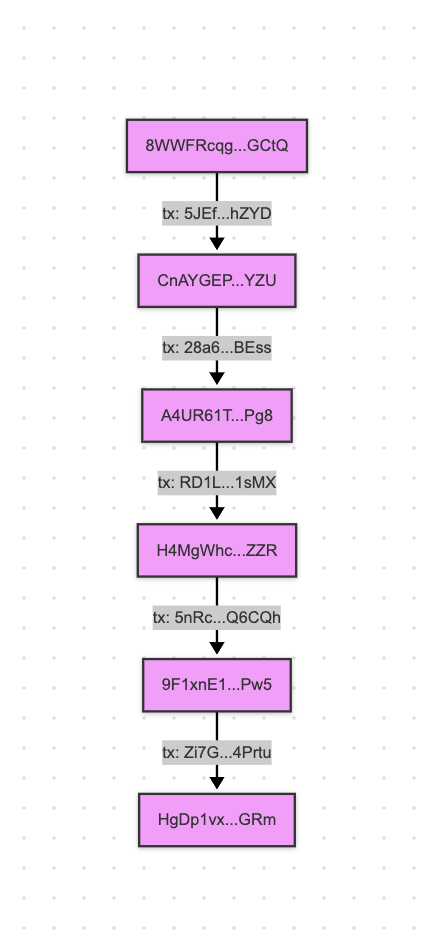

With this funding chain established, we can now examine the central account that appears to coordinate the attack.

## Analysis of `8WWFRcqg7SkjyhGaE6hq6LtEGieX5REmXABnBRpiGCtQ`

The funding addres `8WWFRcqg7SkjyhGaE6hq6LtEGieX5REmXABnBRpiGCtQ` appears to be the main culprit of the attack. Looking at the first attached image, the outflows from this account are primarily to exchanges including KuCoin and Binance, with approximately $34K going to these exchanges:

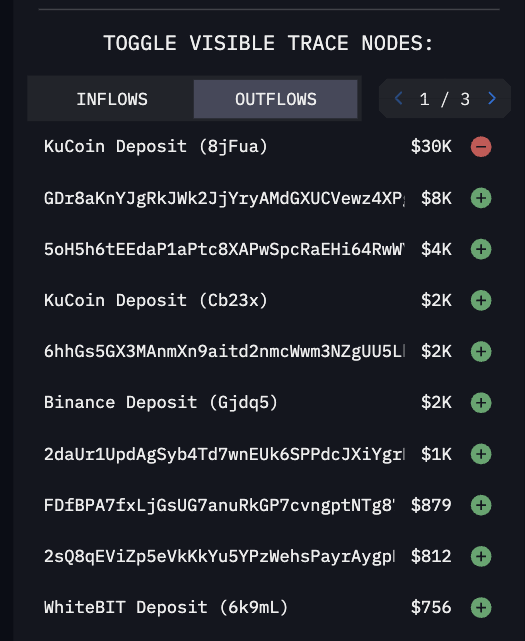

The inflows to this address come from what I am gonna define as "low-transaction accounts" that act as relays to hide direct relationships between accounts most likely owned by the attacker to avoid detections and hiding traces of themselves:

These accounts have very few transactions:

- [3UmTA94gLb5u219cWzVuHycfw5q7aRyhNL712AYrWuAA](https://solscan.io/account/3UmTA94gLb5u219cWzVuHycfw5q7aRyhNL712AYrWuAA): 102 transactions
- [Qk7tLDBkjr8hxtc46KgAJrqJorvR11rbxBNPnyzwGHz](https://solscan.io/account/Qk7tLDBkjr8hxtc46KgAJrqJorvR11rbxBNPnyzwGHz): 4 transactions
- [3ctWzuf9h5SFqX2qPEbZYCUBAvMs9g5CKvRgbsLwRtjw](https://solscan.io/account/3ctWzuf9h5SFqX2qPEbZYCUBAvMs9g5CKvRgbsLwRtjw): 5 transactions
- [8E4K6xjmCvffx9k72oTHw8vEjryBtUvy8x1A1HA8DsYT](https://solscan.io/account/8E4K6xjmCvffx9k72oTHw8vEjryBtUvy8x1A1HA8DsYT): 5 transactions
- [7aVM3PYCJBPTx22tY5NdxWEeBZqPQ8ffvNNcVPSZJFDw](https://solscan.io/account/7aVM3PYCJBPTx22tY5NdxWEeBZqPQ8ffvNNcVPSZJFDw): 5 transactions
- [vJg8ZY9oTsZvu6sd9TMSZMGgqTsPfu2yNPb7MmLNkoi](https://solscan.io/account/vJg8ZY9oTsZvu6sd9TMSZMGgqTsPfu2yNPb7MmLNkoi): 10 transactions
- [C7RZDe7VmWHtqVR1mSVDfExw19Va1zwgjqj4uTzcGxXr](https://solscan.io/account/C7RZDe7VmWHtqVR1mSVDfExw19Va1zwgjqj4uTzcGxXr): 11 transactions

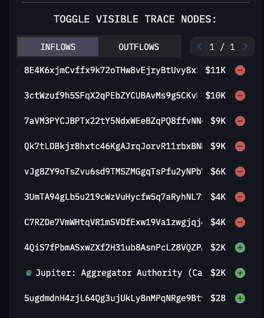

To understand how this account was funded, we need to examine the network of low-transaction accounts that fed into it.

## The Operational Wallets

Following the funding parents of the low-transaction accounts, we can see that the first wallet is directly funded through KuCoin, and along with the rest of the funding parents appear to be performing as what I define as "operational wallets". These accounts do a clean job of converting small amounts of initial SOL (about $20) and a chunk of $SOSA tokens into larger amounts of SOL ($8-10k USD):

- [5NzUPCeQgm9N89frDnE4DV86fjdaqAviGyTahJTbcnDz](https://solscan.io/account/5NzUPCeQgm9N89frDnE4DV86fjdaqAviGyTahJTbcnDz): 57 transactions
- [EQVbYsEwTWrEexcnVp3JDpa5ntzrZfcboiyR52kf6r5J](https://solscan.io/account/EQVbYsEwTWrEexcnVp3JDpa5ntzrZfcboiyR52kf6r5J): 32 transactions
- [9gcbWiJYg8EsKSFW6QxDww94uLVHU8cst4K1frmyoUSY](https://solscan.io/account/9gcbWiJYg8EsKSFW6QxDww94uLVHU8cst4K1frmyoUSY): 33 transactions
- [CWkZqHSPuHiPMTYyTVgPHNpMRcejVVvSZvAFanfToVpP](https://solscan.io/account/CWkZqHSPuHiPMTYyTVgPHNpMRcejVVvSZvAFanfToVpP): 40 transactions
- [DL4Sk6hUWsVSNCj1w4Va7H93BBTTce7ztYRnPnzfz9dD](https://solscan.io/account/DL4Sk6hUWsVSNCj1w4Va7H93BBTTce7ztYRnPnzfz9dD): 17 transactions
- [4Cm2WaArqK6so69XjZoNa3SEF8xGbe4fCDg5hsPKvXWf](https://solscan.io/account/4Cm2WaArqK6so69XjZoNa3SEF8xGbe4fCDg5hsPKvXWf): 33 transactions

The following image shows an Arkham diagram displaying the coordinated nature of these operations:

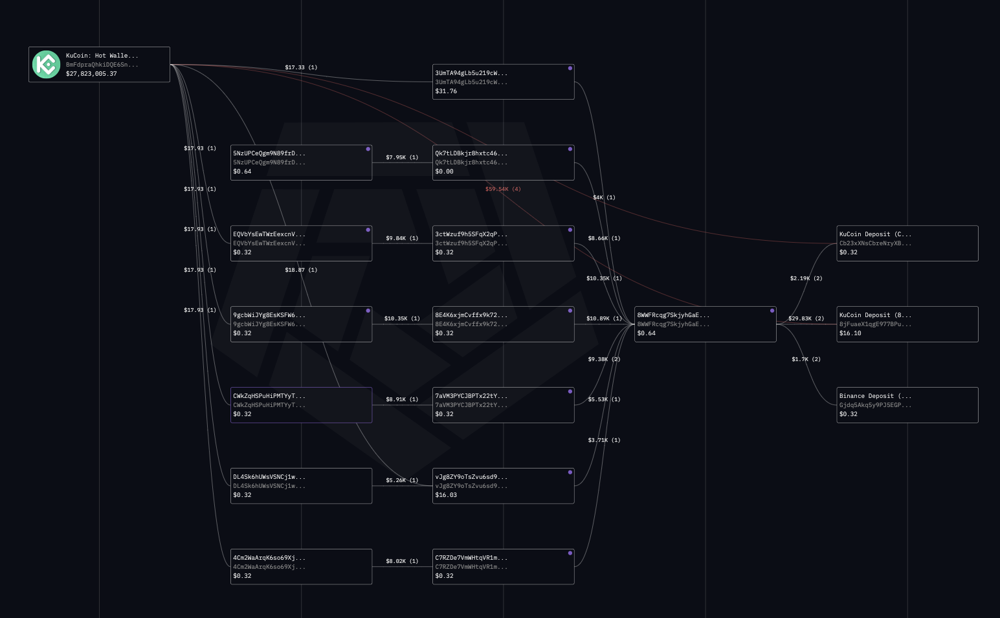

## Where does the SOSA for the operational wallets come from?

Tracking the inflow of SOSA tokens to the operational wallets reveals a coordinated distribution pattern:

### `3UmTA94gLb5u219cWzVuHycfw5q7aRyhNL712AYrWuAA`
- Received +524,224,761.608086 SOSA from `C7RZDe7VmWHtqVR1mSVDfExw19Va1zwgjqj4uTzcGxXr` (a low-transaction account)
- `C7RZDe7VmWHtqVR1mSVDfExw19Va1zwgjqj4uTzcGxXr` received +524,224,761.608086 SOSA and 44.75 SOL from `4Cm2WaArqK6so69XjZoNa3SEF8xGbe4fCDg5hsPKvXWf`
- Notably, `4Cm2WaArqK6so69XjZoNa3SEF8xGbe4fCDg5hsPKvXWf` is also an operational wallet, indicating funds are being circulated among these wallets

### `5NzUPCeQgm9N89frDnE4DV86fjdaqAviGyTahJTbcnDz`
- Received +183,750,000 SOSA from `BDVtp7skpYm25jskqZg9cqw8a65qUg1FG6QoiuRnkZuD`
- `BDVtp7skpYm25jskqZg9cqw8a65qUg1FG6QoiuRnkZuD` received:
  - +183,750,000 SOSA from B2JRgMXGEEwvYjP2YiJbzH5jSNAahu6gUMCKbejxtmTH (SOSA tx: `6kAtxJwbm7H9DsMCddpNKmNH723uUNZRauvM41iPTjLS5cMAJF7xhWMeweAjhEg5uRJbFKBLqCxtf51XV5scKnx`)
  - 0.1 SOL from KuCoin (tx: `2LFi6FDt9MTo5MGUMbn9qJ8571X1Prjmt2oxkx1FF6jYnXnFwWkZAHHS9kUT4s5mMk5toUZkcafha2pMwqZx68kN`)

### `EQVbYsEwTWrEexcnVp3JDpa5ntzrZfcboiyR52kf6r5J`
- Received:
  - +577,500,000 SOSA from B2JRgMXGEEwvYjP2YiJbzH5jSNAahu6gUMCKbejxtmTH (SOSA tx: `4j9XYFa4JQjmyWGXnjW9Pecfjjr9vR1beDAKg6x4RuGHDmo7sy1ENFeTg2UWWttYH1rvhQKX8mT8Ck8oJCFpNqmH`)
  - 0.1 SOL from KuCoin (tx: `5fT2XaTyoYZENPN3RoMvMPasumj81Cj7om9wtaBqiUk1MsrhQ2nPJepjSWYbTSaVxv7b9jSerbUu2ZAR8rcTS3Rh`)

### `9gcbWiJYg8EsKSFW6QxDww94uLVHU8cst4K1frmyoUSY`
- Received:
  - +630,000,000 SOSA from B2JRgMXGEEwvYjP2YiJbzH5jSNAahu6gUMCKbejxtmTH (SOSA tx: `TTTuQHVop9S5gqK8C3uDD2QjGX3eUKBp9GF5ammjrAZXZFNqf4wSqQtgUvaef5H4yjzerUQFN5XhvX4x1bbYAJx`)
  - 0.1 SOL from KuCoin (tx: `5jBkQYfnzkjN6ZqiajzYRxzkwozJJ1C3ZpzCJbABPRiVtquJQbvAvw59GNvKRnVfGAHT1zHJQ38PrregUwsRs36D`)

### `CWkZqHSPuHiPMTYyTVgPHNpMRcejVVvSZvAFanfToVpP`
- Received:
  - +682,500,000 SOSA from B2JRgMXGEEwvYjP2YiJbzH5jSNAahu6gUMCKbejxtmTH (SOSA tx: `5M2GvYJeycbjuhQbsEDT2AQcfHPmLkpJp8Mf6TZpQ6HRxY82VN5h2evSRQsCyunVznDVFq5iwCc82T2aKKSSnqGq`)
  - 0.1 SOL from KuCoin (tx: `5LTBRp7MszETSYzd3AAfyfRCd8k87fVo6P3JSMif4Aca82upCBpMxqkPaih4XhQtSMP2d6aHqg8kvcxSrYGmYSF`)

### `DL4Sk6hUWsVSNCj1w4Va7H93BBTTce7ztYRnPnzfz9dD`
- Received:
  - +735,000,000 SOSA from B2JRgMXGEEwvYjP2YiJbzH5jSNAahu6gUMCKbejxtmTH (SOSA tx: `bfUZPnKVoT7USvdnFTXVJiS5pFMuwZoDsN9QjjW89aEQUNiJ7GzebzukWk4xyyTWx9aKP8RnquTQN6tLchrvrep`)
  - 0.1 SOL from KuCoin (tx: `33cUxbrz4wnNXcZdTv6YJsDP23vLHc3YiSuNsXwnfFwBYaCPRnMWAEPtZuTEdXPMWXdoAsde1gmXP8z8QTyA89Q7`)

### `4Cm2WaArqK6so69XjZoNa3SEF8xGbe4fCDg5hsPKvXWf`
- Received:
  - +787,500,000 SOSA from B2JRgMXGEEwvYjP2YiJbzH5jSNAahu6gUMCKbejxtmTH (SOSA tx: `4tP5NS1ZpnBMyyYDsYRi1tDqvCHu7st87e4sZ9gzYe39RGZDJLcp985kv6eBAAaBEKHegufZuskUnneucqU7uMBL`)
  - 0.1 SOL from KuCoin (tx: `64FAkky6xBywUkQ9dpJu8Q92JmQ2ibEeCxaAFYiArny6Y9ybgCiuBxoU5rxLeUgMFmRA5LZnHUUboA9fLWMbQwGQ`)

This pattern clearly shows that B2JRgMXGEEwvYjP2YiJbzH5jSNAahu6gUMCKbejxtmTH is a central distributor of SOSA tokens to the operational wallets, while KuCoin provides the initial SOL funding. The consistent pattern of distribution and similar transaction types strongly suggests coordinated management of these wallets.

Following pictures are easier to understand the above text. 

for `3UmTA94gLb5u219cWzVuHycfw5q7aRyhNL712AYrWuAA`
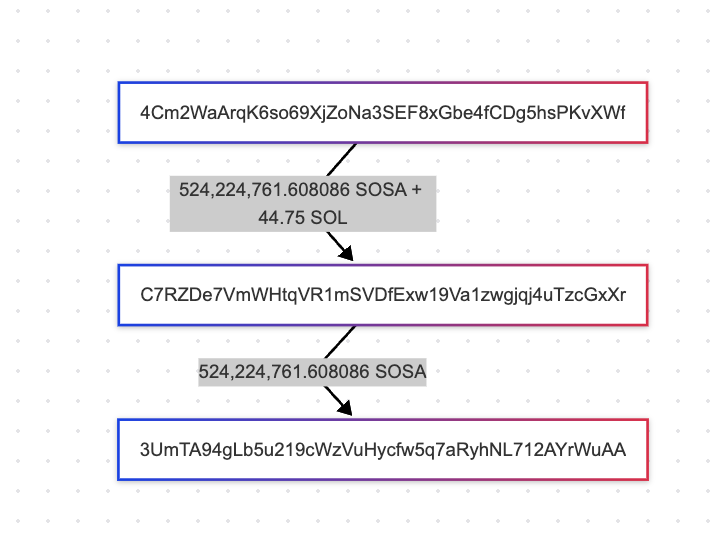

for `5NzUPCeQgm9N89frDnE4DV86fjdaqAviGyTahJTbcnDz`
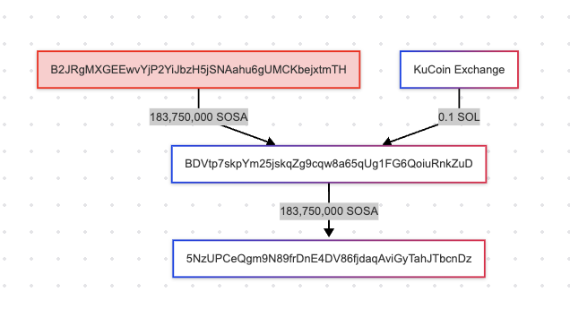

for the rest of the accounts:
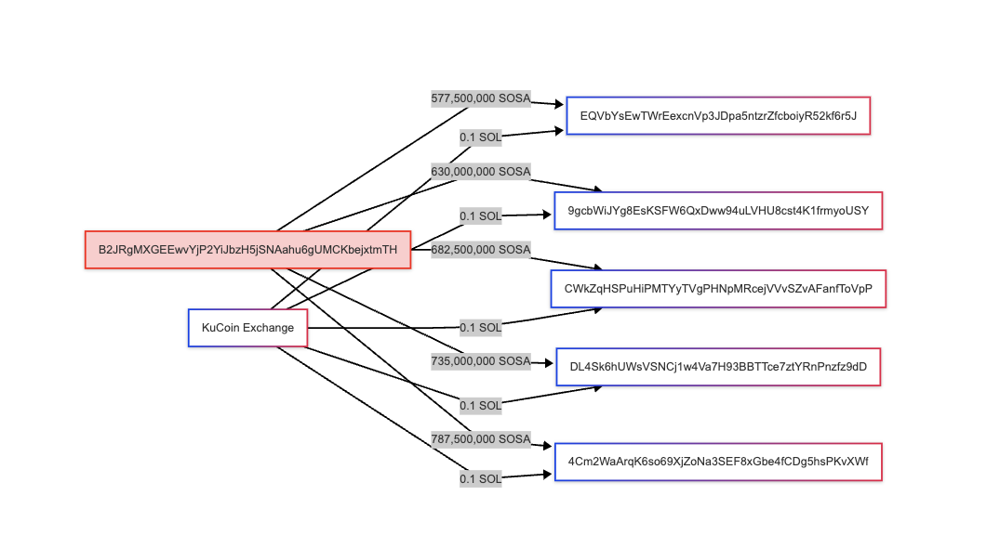

SUS!

### Where does the SOSA for B2JRgMXGEEwvYjP2YiJbzH5jSNAahu6gUMCKbejxtmTH come from?

The wallet B2JRgMXGEEwvYjP2YiJbzH5jSNAahu6gUMCKbejxtmTH receives +15,750,000,000 SOSA from another wallet `5ZoKgtWdStvPzJvoYuRSiUEsGtQLZvzUheV6CkZRwaYB`. This intermediary wallet (`5ZoKgtWdStvPzJvoYuRSiUEsGtQLZvzUheV6CkZRwaYB`) is a low-transaction account that itself receives exactly +15,750,000,000 SOSA from `FDfBPA7fxLjGsUG7anuRkGP7cvngptNTg879jfCykrGT`.

The source wallet `FDfBPA7fxLjGsUG7anuRkGP7cvngptNTg879jfCykrGT` is directly funded by the creator of the SOSA token with +21,000,000,000 SOSA, as will be explained in more detail later.

This creates a chain of token transfers:
- Token creator → `FDfBPA7fxLjGsUG7anuRkGP7cvngptNTg879jfCykrGT` (+21B SOSA)
- `FDfBPA7fxLjGsUG7anuRkGP7cvngptNTg879jfCykrGT` → `5ZoKgtWdStvPzJvoYuRSiUEsGtQLZvzUheV6CkZRwaYB` (+15.75B SOSA)
- `5ZoKgtWdStvPzJvoYuRSiUEsGtQLZvzUheV6CkZRwaYB` → `B2JRgMXGEEwvYjP2YiJbzH5jSNAahu6gUMCKbejxtmTH` (+15.75B SOSA)

Notably, `FDfBPA7fxLjGsUG7anuRkGP7cvngptNTg879jfCykrGT` receives 380 SOL from `2YyuEm5R7v9KmYWfUvXyW6jdqp9DGtavXHNdLXjJAiYy` which is the primary account where everything happens from as seen in the next section. 

The funds that go out of this account come from rinsing the SOSA tokens into SOL in a pump and dump scheme either on the follower base of the promoter account ([See SOSA section](#the-sosa-token)). As the study of transactions on Solana are almost impossible thanks to the incompetence of the Solana Foundation, and after 4 years there isn't even a tool to see the historical balance for an address, I wrote my own tool to chart the historical balance of all the above accounts to show the gradual accumulation of SOL into these accounts before the SOL being transferred out to the low-transaction accounts and subsequently into `8WWFRcqg7SkjyhGaE6hq6LtEGieX5REmXABnBRpiGCtQ`.  (And no I am not open sourcing it until Solana Foundation pays)

### Historical Balance Charts

`3UmTA94gLb5u219cWzVuHycfw5q7aRyhNL712AYrWuAA`
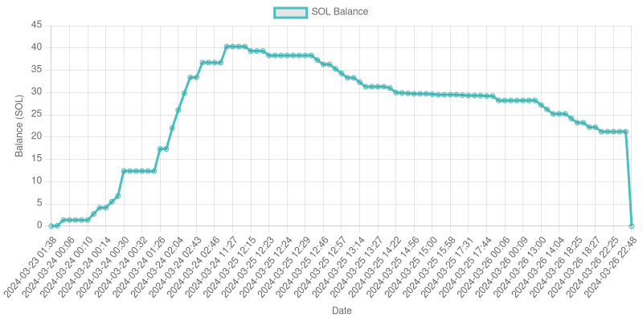

`5NzUPCeQgm9N89frDnE4DV86fjdaqAviGyTahJTbcnDz`
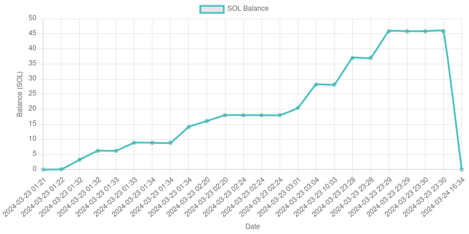

`EQVbYsEwTWrEexcnVp3JDpa5ntzrZfcboiyR52kf6r5J`
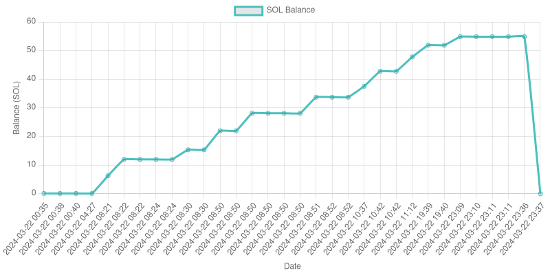

`9gcbWiJYg8EsKSFW6QxDww94uLVHU8cst4K1frmyoUSY`
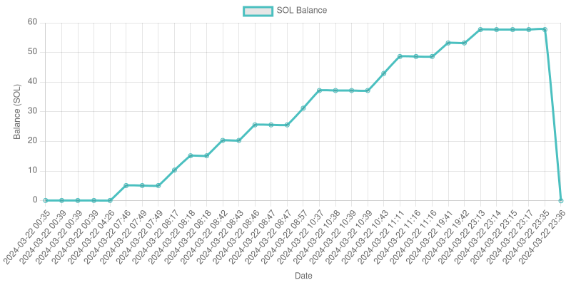

`CWkZqHSPuHiPMTYyTVgPHNpMRcejVVvSZvAFanfToVpP`
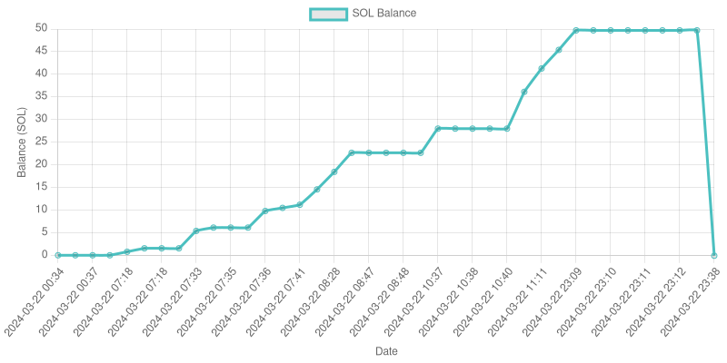

`DL4Sk6hUWsVSNCj1w4Va7H93BBTTce7ztYRnPnzfz9dD`
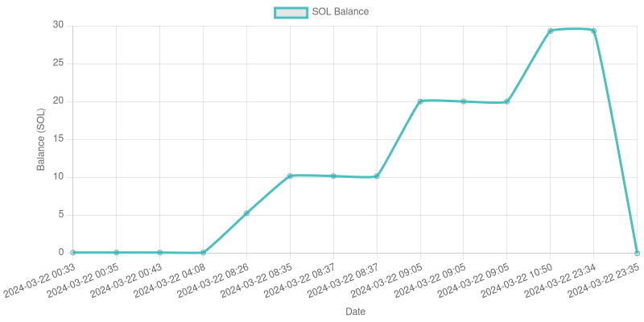

`4Cm2WaArqK6so69XjZoNa3SEF8xGbe4fCDg5hsPKvXWf`
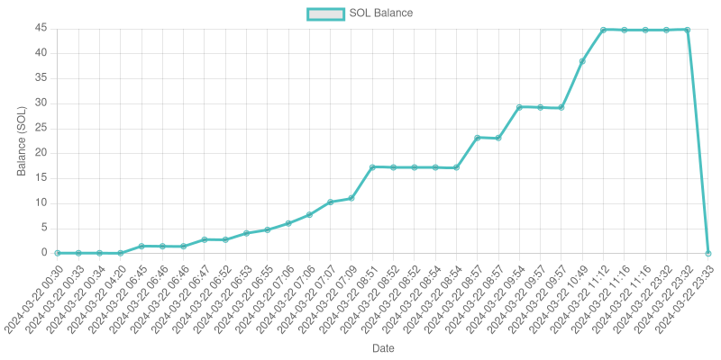

Interestingly the total outflow of SOL from this account sums up to around 350 SOL which is very close to the 380 SOL that is used for the original LP of the SOSA token (considering this is not all the accounts with inflow into `8WWFRcqg7SkjyhGaE6hq6LtEGieX5REmXABnBRpiGCtQ` as it clutters the analysis overshadowing the principal basis of the attack without providing any additional useful information) pointing to the total amount being laundered to be 380 SOL or so. 

## The SOSA Token 

The $SOSA token (address: `E7ifRrWiGV3RVLnfw6jUxs6sd9rAST9UXgBKP1UznMjs`) was created by `3fV9AqAYbgdQcLp8sdb2uEbuQoYvXfbSMuCUV37B1JaE`.

Pool creation transaction: [58Zn...b3Mqg](https://solscan.io/tx/58Zn4fo9X7V5FyWB7bWwjYhZWbYG936FKgSMsk2CkXkZ5fWs6kEBiN4jL1JmCjyZFu2nmmGM2jFGG3d71bsb3Mqg)

Pool Creation TX: `58Zn4fo9X7V5FyWB7bWwjYhZWbYG936FKgSMsk2CkXkZ5fWs6kEBiN4jL1JmCjyZFu2nmmGM2jFGG3d71bsb3Mqg`
LP Pool: `YYTaffG5QLM9T8sQTPKdBFmYUetLCo2toLmENCqviPc`
Raydium Pool Solana Account: `5ZPUeEgwygoiido5D1YQ1onFuWELhH9usU2atCekTAd9`
Raydium Pool SOSA Account: `9EsZGaYXdLVHpXMUPpnf1qHyqdEFWSYsjUmduS4oHzvh`
Original LP provider: `Abitb5UpKTrxpjuh8u9zcCQRY5LChCuUcyK4c4c3Yu8i`

SOSA price at the time of creation: 7.2e-8 SOL
SOSA price at the time of this report: 7.58901e-9 SOL

DEX Screener P&D chart: https://dexscreener.com/solana/E7ifRrWiGV3RVLnfw6jUxs6sd9rAST9UXgBKP1UznMjs 

The SOSA-SOL pool was initialized with 5.25B SOSA and 378 SOL, pricing SOSA at approximately 7.2381e-8 SOL per token.

Following the original LP provider's funding parents:

`2YyuEm5R7v9KmYWfUvXyW6jdqp9DGtavXHNdLXjJAiYy` → via [tx 7vNr...GMsyy](https://solscan.io/tx/7vNrsS1Em9ShmyJTyi3dN5UsMXLNxwaqcFDQJZ6ojAK8X7hoC5fATPYfKjrxH6UPfkWAsNSMHgsHmss6xXGMsyy) to  
`FDfBPA7fxLjGsUG7anuRkGP7cvngptNTg879jfCykrGT` → via [tx 2JFR...Te3r2](https://solscan.io/tx/2JFRvbDP4rQhgVJPpeBopPcYMUnr5dnatnmwm7RA2zqvsqRxdUMK2z58Z4oyj7YZTNYjCKXJix4bDkhHGemTe3r2) to  
`Abitb5UpKTrxpjuh8u9zcCQRY5LChCuUcyK4c4c3Yu8i`

The LP tokens created by `Abitb5UpKTrxpjuh8u9zcCQRY5LChCuUcyK4c4c3Yu8i` are sent to `B2JRgMXGEEwvYjP2YiJbzH5jSNAahu6gUMCKbejxtmTH` and then burnt which means all these wallets are most certainly the same person just trying to camouflage themselves or their intimate relationships. 

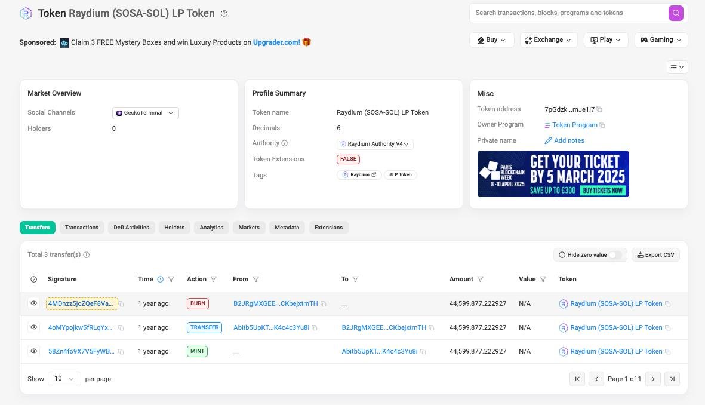

Notably, `FDfBPA7fxLjGsUG7anuRkGP7cvngptNTg879jfCykrGT` received 21B SOSA directly from the token creator even before getting funded with 380 SOL from `2YyuEm5R7v9KmYWfUvXyW6jdqp9DGtavXHNdLXjJAiYy`. This strongly suggests that the token creator and the original LP provider are connected.

## `2YyuEm5R7v9KmYWfUvXyW6jdqp9DGtavXHNdLXjJAiYy` is the attacker or knows the attacker for sure!

The culmination of all this seems to be the fact that whoever is the owner of this account knows our very dear `8WWFRcqg7SkjyhGaE6hq6LtEGieX5REmXABnBRpiGCtQ` and by the funding parenting proxy our belated authority of Snapper `HgDp1vxXwNGQyeP8RxP9Af26pyeW3cTG98gNKytBEGRm`. 

First of all this account has a notable history of constant inflow of SOL into it until it reaches levels of 700-800 SOL after which it starts offloading batches of 150-160 and lastly 380 SOL out, the latter of which is used to fund the whole SOSA saga explained in this article. This can be seen from the historical balance chart of the account. 

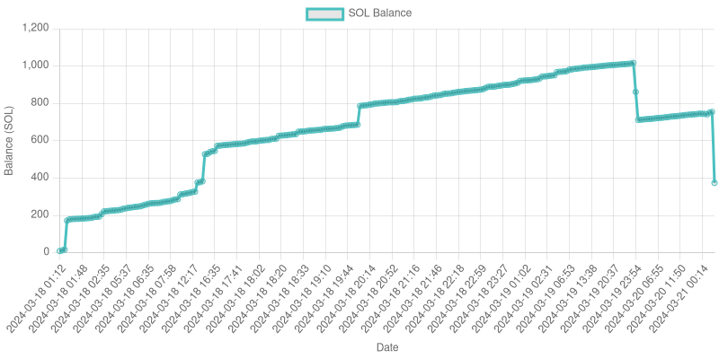

A simple search for `2YyuEm5R7v9KmYWfUvXyW6jdqp9DGtavXHNdLXjJAiYy` online reveals results for some social media accounts promoting the sale of the SOSA token so I doubt they are mainly in contact with this token creator. 

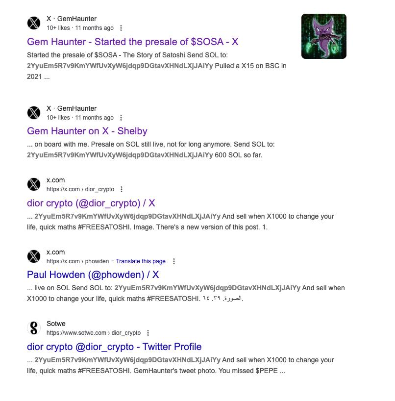

The accounts and tweets:

https://x.com/GemHaunter/status/1769531589141131522
https://x.com/GemHaunter/status/1769784437301035277
https://www.sotwe.com/dior_crypto

The other two links are broken and don't open!

Especially this tweet stands out as someone that probably directly knows the token creator and the whole crew involved most likely:

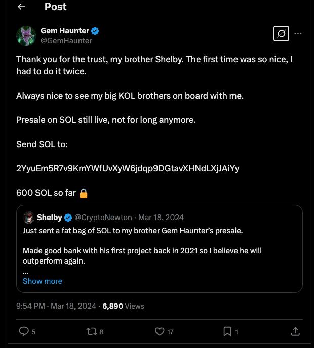

This tweet directly implies that the main developer/creator/promoter of the SOSA token is a person named "GemHaunter"

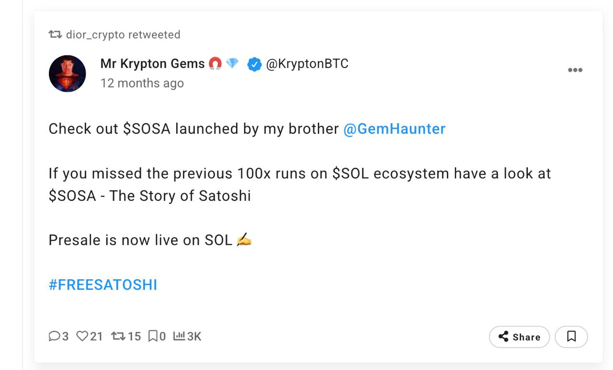

Some future references and data points to look into in case someone wants to fund this operation of mine: 

- The SOSA pool has still around 125 SOL in it and the chart has a massive pump during the 2 day period after launch between Mar 22nd, 2024 and Mar 24th, 2024. Analyzing the trades on this pool does contain additional useful information in my opinion. 

## Conclusion

This investigation has traced the Snapper DEX attack through a web of transactions designed to hide the attacker's identity. The evidence points to a coordinated operation involving:

1. The creation and manipulation of the SOSA token as a funding mechanism
2. A network of operational wallets that converted SOSA tokens to SOL
3. Low-transaction relay accounts that further obscured the money trail
4. Final laundering of funds through KuCoin and other exchanges

The wallet `2YyuEm5R7v9KmYWfUvXyW6jdqp9DGtavXHNdLXjJAiYy` appears to be central to this operation, with connections to social media accounts promoting SOSA, particularly one using the name "GemHaunter." The consistent patterns in wallet funding, transaction timing, and fund distribution strongly suggest that all these accounts are controlled by the same entity or a closely coordinated group.
