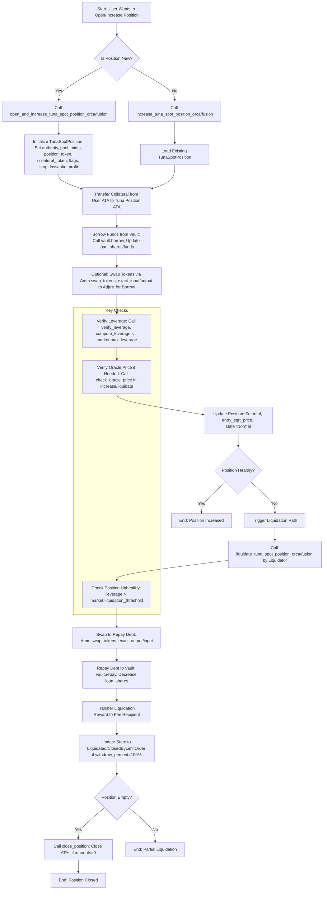
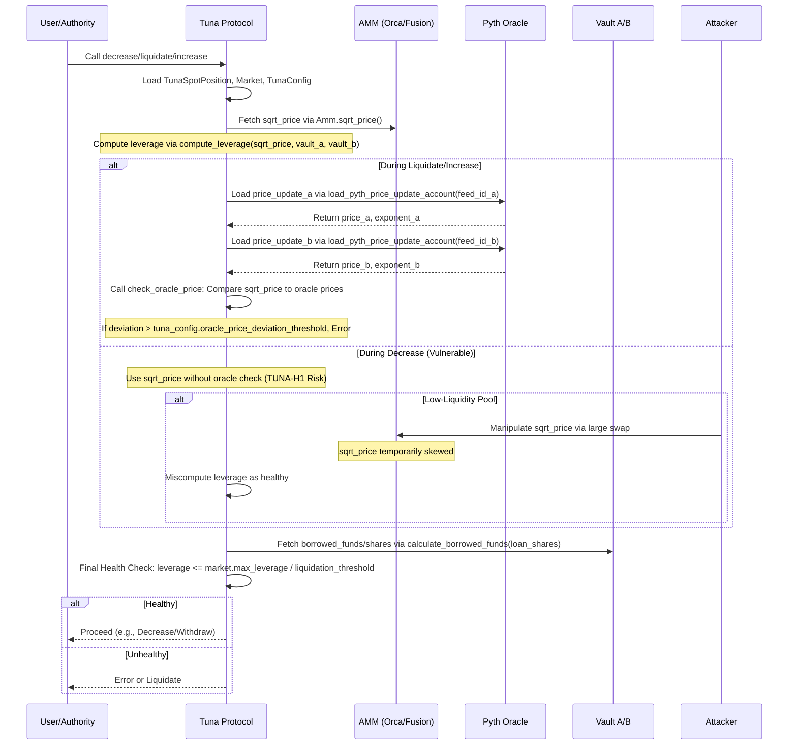

# TUNA Audit Report
<div align="center">

</div>


- David P – [david@oshield.io](mailto:david@oshield.io)
- BlueWolf – [blue@oshield.io](mailto:blue@oshield.io)
- Mikb – [mika@oshield.io](mailto:mika@oshield.io)

## Executive Summary
OShield performed a comprehensive security audit of the Tuna protocol, a decentralized leveraged trading protocol on the Solana blockchain featuring spot trading and limit order functionality. The audit identified 6 vulnerabilities: 2 critical-severity issues [TUNA-C1: Precision Loss in Repay Amount Calculation](#tuna-c1-precision-loss-in-repay-amount-calculation), and [Tuna-C2: Post-Swap Leverage Miscalculation](#tuna-c2-post-swap-leverage-miscalculation), 1 high-severity issue [TUNA-H1: Inconsistent Oracle Usage in Position Health Checks](#tuna-h1-inconsistent-oracle-usage-in-position-health-checks), 2 medium-severity issues [TUNA-M1: Collateral Increase via Direct Transfer and Zero-Fee](#tuna-m1-collateral-increase-via-direct-transfer-and-zero-fee) and [TUNA-M2: Incorrect Tick Index Calculation](#tuna-m2-incorrect-tick-index-calculation), 1 low-severity issue [TUNA-L1: Non-Borrowed Position Cannot Be Decreased](#tuna-l1-non-borrowed-position-cannot-be-decreased). The critical-severity issues posed a threat to protocol funds, while the high-severity issue could lead to position corruption affecting all users. The audit employed a systematic methodology including semantic code analysis, vulnerability pattern recognition, comparative analysis with established protocols (Orca Whirlpools and FusionAMM), and edge case testing. Particular attention was given to debt repayment mechanisms, position health checks, and oracle price validation. OShield's recommendations focus on implementing proper position state constraints, checked arithmetic operations with minimum repayment thresholds, and consistent oracle validation mechanisms to ensure Tuna's security and reliability within the Solana DeFi ecosystem.

## Table of Contents
- [Tuna Audit Report](#tuna-audit-report)
- [Table of Contents](#table-of-contents)
- [1. Introduction](#1-introduction)
- [2. Findings & Recommendations](#2-findings--recommendations)
- [2.1. Findings Summary](#21-findings-summary)
- [2.2. Findings Description](#22-findings-description)
- [TUNA-C1: Precision Loss in Repay Amount Calculation](#tuna-c1-precision-loss-in-repay-amount-calculation)
- [Tuna-C2: Post-Swap Leverage Miscalculation](#tuna-c2-post-swap-leverage-miscalculation)
- [TUNA-H1: Inconsistent Oracle Usage in Position Health Checks](#tuna-h1-inconsistent-oracle-usage-in-position-health-checks)
- [TUNA-M1: Collateral Increase via Direct Transfer and Zero-Fee](#tuna-m1-collateral-increase-via-direct-transfer-and-zero-fee)
- [TUNA-M2: Incorrect Tick Index Calculation](#tuna-m2-incorrect-tick-index-calculation)
- [TUNA-L1: Non-Borrowed Position Cannot Be Decreased](#tuna-l1-non-borrowed-position-cannot-be-decreased)
- [3. Protocol Overview](#3-protocol-overview)
- [3.1 Program Charts](#31-program-charts)
- [Tuna position lifecycle](#tuna-position-lifecycle)
- [Tuna price validation and health check sequence diagram](#tuna-price-validation-and-health-check-sequence-diagram)
- [4. Methodology](#4-methodology)
- [5. Scope and Objectives](#5-scope-and-objectives)
- [Repository Information](#repository-information)

## 1. Introduction
This audit focuses on Tuna, a leveraged trading protocol built natively for Solana. Tuna leverages Solana's high throughput and low latency to provide efficient trading through a system that combines spot trading with integrated limit order functionality. The protocol implements leveraged positions, collateral and debt management, and sophisticated position handling to optimize trading strategies and user experience.
This audit included a comprehensive review of the protocol's smart contract code with particular attention to economic vulnerabilities, arithmetic safety, position state management, and security implications of token interactions. Special focus was placed on the protocol's debt repayment mechanisms, position health checks, and oracle price validation mechanisms. Tuna represents an important infrastructure component for the Solana DeFi ecosystem, and ensuring its security and correctness is critical for both the protocol and its users. The audit was conducted with close collaboration of the Tuna team, demonstrating their commitment to security and transparency.

## 2. Findings & Recommendations
Our severity classification system adheres to the criteria outlined here.
| Severity Level | Exploitability | Potential Impact | Examples |
|----------------|----------------|------------------|-----------|
| 🔴 Critical | Low to moderate difficulty, 3rd-party attacker | Irreparable financial harm | Direct theft of funds, permanent freezing of tokens/NFTs |
| 🟠 High | High difficulty, external attacker or specific user interactions | Recoverable financial harm | Temporary freezing of assets |
| 🟡 Medium | Unexpected behavior, potential for misuse | Limited to no financial harm, non-critical disruption | Escalation of non-sensitive privilege, program malfunctions |
| 🔵 Low | Implementation variance, uncommon scenarios | Zero financial implications, minor inconvenience | Program crashes in rare situations |
| ℹ️ Informational | N/A | Recommendations for improvement | Design enhancements, best practices |

### 2.1. Findings Summary
| Finding | Description | Severity Level |
|---------|-------------|----------------|
| [TUNA-C1] | Precision Loss in Repay Amount Calculation | 🔴 Critical |
| [TUNA-C2] | Post-Swap Leverage Miscalculation | 🔴 Critical |
| [TUNA-H1] | Inconsistent Oracle Usage in Position Health Checks | 🟠 High |
| [TUNA-M1] | Collateral Increase via Direct Transfer and Zero-Fee | 🟡 Medium |
| [TUNA-M2] | Incorrect Tick Index Calculation | 🟡 Medium |
| [TUNA-L1] | Non-Borrowed Position Cannot Be Decreased | 🔵 Low |

### 2.2. Findings Description
#### TUNA-C1: Precision Loss in Repay Amount Calculation
##### Description
The `repay_debt` function in `tuna_position.rs` calculates the repay amount using integer division, which can truncate to 0 for small borrow amounts and repay percentages. The problematic lines are:
```rust
let repay_amount_a = (vault_a.calculate_borrowed_funds(tuna_position.get_loan_shares().0, Rounding::Up)? as u128 * repay_percent as u128 / HUNDRED_PERCENT as u128) as u64;
let repay_amount_b = (vault_b.calculate_borrowed_funds(tuna_position.get_loan_shares().1, Rounding::Up)? as u128 * repay_percent as u128 / HUNDRED_PERCENT as u128) as u64;
```
Here, `HUNDRED_PERCENT` is 1_000_000. If the borrowed funds (from `calculate_borrowed_funds`) are less than 1_000_000 and `repay_percent` is small (e.g., 1), the multiplication and division truncate the result to 0 due to integer math. For example:
- Borrowed funds = 100_000, repay_percent = 1.
- Calculation: (100_000 * 1) / 1_000_000 = 0.1 → truncates to 0.
This allows users to call `decrease_tuna_spot_position_orca` or `decrease_tuna_spot_position_fusion` to withdraw tokens without repaying any debt, increasing the position's leverage beyond `market.get_max_leverage()`.

Exploitation steps:
1. Open a position with `increase_tuna_spot_position_orca` or `increase_tuna_spot_position_fusion`, borrowing a small amount < 1_000_000 (e.g., 100_000 tokens) to reach max_leverage.
2. Call `decrease_tuna_spot_position_orca` or `decrease_tuna_spot_position_fusion` with `withdraw_percent = 1`.
3. Due to `repay_amount = 0`, withdraw a small amount of `position_token` without reducing `loan_shares/funds`, increasing leverage.
4. Repeat step 2 infinitely until leverage exceeds `max_leverage` or hits `liquidation_threshold`, extracting extra tokens without repaying debt.
Any position owner can exploit their own position; no special permissions needed.

##### Impact
- Users can exceed `max_leverage`, violating protocol invariants and risking bad debt in vaults.
- Repeated exploitation allows infinite token extraction, leading to protocol insolvency.

##### Implemented Solution
To fix this issue, the developers have decided to replace the integer division in the `repay_debt` function with the `mul_div_64` function using `Rounding::Up` to ensure proper rounding of repay amounts, preventing truncation to zero and stopping users from withdrawing tokens without repaying debt.

```diff
// Updated calculation in repay_debt
+let repay_amount_a = mul_div_64(vault_a.calculate_borrowed_funds(tuna_position.get_loan_shares().0, Rounding::Up)?, repay_percent as u64, HUNDRED_PERCENT as u64, Rounding::Up,)?;
+let repay_amount_b = mul_div_64(vault_b.calculate_borrowed_funds(tuna_position.get_loan_shares().1, Rounding::Up)?, repay_percent as u64, HUNDRED_PERCENT as u64, Rounding::Up,)?;
```

- [View Commit](https://github.com/DefiTuna/tuna-programs/commit/ae2f557f2c512caf93e9ae837f04289c6e0d4368)

#### TUNA-C2: Post-Swap Leverage Miscalculation
##### Description
The `increase` function in `tuna_spot_position.rs` calculates the leverage of a position using the post-swap price of the pool, which can be manipulated by a large swap, leading to an incorrect assessment of leverage health. The problematic line is:

```rust
tuna_position::verify_leverage::<TunaSpotPosition>(tuna_position, &market, &vault_a, &vault_b, amm.sqrt_price())?;
```

This line calls `verify_leverage` with `amm.sqrt_price()`, which reflects the pool's price **after** the swap executed in:

```rust
amm.swap_tokens_exact_input(
    if position_token == PoolToken::A {
        tuna_position_ata_b.amount
    } else {
        tuna_position_ata_a.amount
    },
    position_token == PoolToken::B,
)?;
amm.reload_pool()?;
```

The issue arises because the swap can significantly move the pool's price, especially with high `max_swap_slippage` (e.g., 100%, allowing the price to double). The leverage is then calculated based on this manipulated post-swap price, making a highly leveraged position appear within the allowed range.

Exploitation Steps: 

Consider a user opening a long position on `tokenA` with the following steps:

1. User deposits $1M USDC as collateral and borrows $9M USDC to long `tokenA`, swapping $10M USDC for `tokenA` in the pool.
2. The swap doubles `tokenA`'s price due to high slippage, and `amm.reload_pool()?` updates the pool's price to this new value.
3. `verify_leverage` uses the post-swap price.
4. In reality, the user has $1M collateral and $9M borrowed, implying a true leverage of 10x before the price pump.
5. The user can then dump `tokenA` (from prior holdings or unlocked tokens) to crash the price back to original, profiting from selling at the inflated price.
6. The position may become insolvent, potentially leaving the protocol with bad debt if liquidated.

##### Impact
- Attackers can open over-leveraged positions by manipulating the post-swap `sqrt_price`, making unhealthy positions appear within acceptable leverage limits.
- Use of post-swap `sqrt_price` without pre-swap validation or moving average comparison increases susceptibility to price manipulation, as temporary price pumps are not mitigated.
- Potential for significant bad debt accumulation in vaults, as manipulated positions may become underwater upon price correction, leaving insufficient collateral to cover borrowed funds.
- Protocol miscalculates position health, allowing users to extract profits from inflated prices while leaving the protocol vulnerable to losses upon liquidation.


##### Implemented Solution

To fix this issue, leverage verification implementation now occurs before swaps for spot positions, using pre-swap `sqrt_price`. For LP positions, it's checked before and after swaps to account for dual-token borrowing. This prevents price manipulation from affecting leverage health assessments.
- [View Commit](https://github.com/DefiTuna/tuna-programs/commit/7ab84d0b06c3786dcc43bce7c8c20189bbdf6ceb)


#### TUNA-H1: Inconsistent Oracle Usage in Position Health Checks
##### Description

For trading pairs without a Pyth oracle The `increase` and `decrease` functions in `tuna_spot_position.rs` rely solely on AMM’s `sqrt_price` to calculate a position’s health and risk.

The absence of oracle validation or a moving average in `decrease` and `increase` allows attackers to manipulate the AMM’s `sqrt_price` (e.g., via large swaps).

Exploitation steps:

1. A large position is about to get liquidated due to unhealthy status. 
2. The user does a flash loan for a huge amount of money.
3. The user then pumps or dumps the pool price in their desired direction to restore the position’s health. 
4. The user decreases their position, withdrawing excess tokens.
5. Market sell or buy to repay the flash loan.
6. User claims tokens that should have been liquidated, draining value from protocol users.

##### Impact
- Attackers can bypass liquidation checks by manipulating `sqrt_price`, allowing withdrawals from unhealthy positions.
- Reliance on single-shot `sqrt_price` without a moving average amplifies manipulation risks, as temporary price spikes are not smoothed out.
- Potential for bad debt accumulation in vaults, as unhealthy positions persist without repayment.

##### Implemented Solution
Two fixes were implemented to address price manipulation vulnerabilities:
1. For the FusionAMM, a linear moving average price was introduced, updated after each swap to smoothen out price fluctuations.

   - [View Commit](https://github.com/DefiTuna/fusionamm/commit/3000d8689f3da2a8a31c05d851bbf02a01a91adc)

2. In the absence of a Pyth oracle, the system now validates `sqrt_price` against the moving average price (`ma_sqrt_price`) to ensure price reliability.
```rust
if borrow_amount > 0 {
    if is_oracle_set(&pyth_oracle_price_feed_a, &pyth_oracle_price_feed_b) {
        check_oracle_price(
            &Clock::get()?,
            sqrt_price,
            &vault_a.pyth_oracle_feed_id.to_bytes(),
            &pyth_oracle_price_feed_a,
            mint_a.decimals,
            &vault_b.pyth_oracle_feed_id.to_bytes(),
            &pyth_oracle_price_feed_b,
            mint_b.decimals,
            market.get_oracle_price_deviation_threshold(&tuna_config),
            DEFAULT_MAX_PRICE_AGE,
        )?;
    } else {
        check_ma_price(sqrt_price, amm.ma_sqrt_price(), market.get_oracle_price_deviation_threshold(&tuna_config))?;
    
}
```
   - [View Commit](https://github.com/DefiTuna/tuna-programs/commit/d9db3b35364567448a2bb14a06aee66f1b7be354)

#### TUNA-M1: Collateral Increase via Direct Transfer and Zero-Fee
##### Description

The `increase` function in `tuna_spot_position.rs` allows users to manipulate collateral by depositing tokens via direct transfer before calling `increase` with a small `collateral_amount`. The protocol fee is calculated based on the small `collateral_amount`, not the total ATA balance, enabling users to gain a large collateral boost with a minimal fee. 


```rust
amm.reload_pool()?;
tuna_position_ata_a.reload()?;
tuna_position_ata_b.reload()?;
let new_position_amount = if position_token == PoolToken::A {
    tuna_position_ata_a.amount
} else {
    tuna_position_ata_b.amount
};
tuna_position.amount = new_position_amount;
```

If a user transfers 1,000,000 USDC to `tuna_position_ata_a` externally, then calls `increase` with `collateral_amount = 1`, the fee is based on 1 USDC, while the position gains the full 1,000,001 USDC as collateral, inflating its value.

Exploitation Steps:
1. Transfer a large amount (e.g., 1,000,000 USDC) to `tuna_position_ata_a` via an external token transfer after the initial `process_directly_transferred_tokens` call.
2. Call `increase_tuna_spot_position_orca` or `increase_tuna_spot_position_fusion` with `collateral_amount = 1` and `borrow_amount = 1`.
3. The protocol charges a fee on 2 USDC, but `tuna_position_ata_a.amount` (1,000,002 USDC) boosts collateral with effectively 0 fee on the 1,000,000 USDC.
4. Use the inflated collateral to increase leverage or withdraw value.
Any position owner can exploit this, no special permissions are needed beyond token transfer timing.

##### Impact
- Users can gain disproportionate collateral with minimal fees.
- Protocol loses fee revenue.


##### Implemented Solution

To fix this issue, the developers added a second call to `process_directly_transferred_tokens` before the reloads to re-evaluate and fee any new direct transfers, ensuring the collateral amount reflects the total ATA balance with proper fees.

```rust
process_directly_transferred_tokens(
    mint_a,
    mint_b,
    market,
    tuna_position,
    tuna_position_ata_a,
    tuna_position_ata_b,
    fee_recipient_ata_a,
    fee_recipient_ata_b,
    token_program_a,
    token_program_b,
    memo_program,
)?;
```

- [View Commit](https://github.com/DefiTuna/tuna-programs/commit/e7c61c2479486cdb3dd4725b1a90d6b1c03a279f)

#### TUNA-M2: Incorrect Tick Index Calculation
##### Description

In the `rebalance` function of `tuna_lp_position.rs`, the calculation of `tick_lower_index` and `tick_upper_index` can result in tick indices that fall outside the valid range of minimum and maximum ticks supported by the protocol. The issue arises from using the absolute `position_range` to compute the new tick indices relative to the current price tick.

```rust
let tick_lower_index = amm.tick_current_index().div_euclid(tick_spacing) * tick_spacing - position_range / (2 * tick_spacing) * tick_spacing;
```
Here, `position_range / (2 * tick_spacing) * tick_spacing` calculates the offset for the lower and upper ticks based on the absolute range of the position. If `position_range` is sufficiently large, subtracting or adding this offset from the current price tick (`amm.tick_current_index`) can push `tick_lower_index` below the minimum allowed tick or push `tick_upper_index` above the maximum allowed tick. This makes it impossible to rebalance the position, as the resulting tick indices are invalid.

 Exploitation Steps :

1. A user initiates a rebalance of a liquidity position with a large `position_range`.
2. The `rebalance` function calculates `tick_lower_index` and `tick_upper_index` using the formula above.
3. If `position_range` is large enough, the calculated `tick_lower_index` falls below the minimum tick (e.g., `-443636`) or `tick_upper_index` exceeds the maximum tick (e.g., `443636`).
4. The rebalance operation fails due to invalid tick indices, rendering the position impossible to rebalance.
5. This can lock the position in an unusable state or prevent proper liquidity provision.

##### Impact

- Any user with a liquidity position can encounter this issue if the `position_range` is sufficiently large.
- No special permissions are required beyond initiating a rebalance.
- Affected positions may become stuck, preventing users from adjusting liquidity or exiting positions, potentially leading to loss of funds or missed opportunities.


##### Implemented Solution

The issue has been addressed by replacing the problematic code with a new implementation that ensures tick indices stay within valid bounds:

```rust
let half_range = position_range / (2 * tick_spacing) * tick_spacing;
let position_center = amm.tick_current_index().div_euclid(tick_spacing) * tick_spacing;
let mut tick_lower_index = (position_center - half_range).max(MIN_TICK_INDEX);
let tick_upper_index = (tick_lower_index + position_range).min(MAX_TICK_INDEX);
if tick_upper_index == MAX_TICK_INDEX {
    tick_lower_index = MAX_TICK_INDEX - position_range;
}
```

[View Commit](https://github.com/DefiTuna/tuna-programs/commit/869986a730023c494b4b034eb62f8ee6fb7927c1)


#### TUNA-L1: Non-Borrowed Position Cannot Be Decreased
##### Description
The `decrease` function in `tuna_spot_position.rs` prevents positions with no borrowed funds (`loan_shares = 0`) from being decreased due to an erroneous `BadDebt` error, locking collateral in the position’s associated token accounts (ATAs). The problematic conditional is:
```rust

    if tuna_position.loan_shares > 0 {
        msg!("Decreasing position by {:.2}%", withdraw_percent as f64 / HUNDRED_PERCENT as f64 * 100.0);
        msg!("Current sqrt_price: {}; tick: {}", sqrt_price, amm.tick_current_index());

        require!(withdraw_percent > 0 && withdraw_percent <= HUNDRED_PERCENT, ErrorCode::InvalidInstructionArguments);
        require!(tuna_position.total > 0, ErrorCode::UnexpectedValue);
        require!(!tuna_position.is_liquidated_or_closed(), ErrorCode::PositionIsLiquidated);

        // Accrue interest in order to be able to compute the exact amount of borrowed funds.
        let clock = Clock::get()?;
        vault_a.accrue_interest(clock.unix_timestamp as u64)?;
        vault_b.accrue_interest(clock.unix_timestamp as u64)?;

        // An unhealthy position must be liquidated.
        if !tuna_position.is_healthy(sqrt_price, market, vault_a, vault_b)?.0 {
            return Err(ErrorCode::PositionIsUnhealthy.into());
        }

```
For non-borrowed positions (`loan_shares = 0`), `repay_amount_a` and `repay_amount_b` are 0 (as calculated in `repay_debt` via `vault_a.calculate_borrowed_funds(tuna_position.get_loan_shares().0, Rounding::Up)`), thus creating a situation where users that only deposited collateral and didn't borrow are unable to withdraw their collateral. Users must borrow to bypass this error, which is unnecessary for collateral-only positions.

Exploitation steps:
1. Open a position using `increase_tuna_spot_position_orca` or `increase_tuna_spot_position_fusion` with `collateral_amount > 0` and `borrow_amount = 0`, setting `loan_shares = 0` and `total > 0`.
2. Attempt to withdraw collateral by calling `decrease_tuna_spot_position_orca` or `decrease_tuna_spot_position_fusion` with any `withdraw_percent`.
3. The function fails with `ErrorCode::BadDebt` due to the conditional, despite no debt existing.
4. The owner’s collateral remains locked in `tuna_position_ata_a/b`, requiring a workaround (borrowing and repaying) to unlock funds.
Only the position owner can call `decrease`, and the issue affects any non-borrowed position with collateral, requiring no special conditions.

##### Impact
- User collateral is locked in non-borrowed positions, preventing withdrawal and causing financial inconvenience.
- Users must borrow and repay to withdraw collateral, increasing transaction costs and complexity.
- Reduced protocol usability, as collateral-only positions require unnecessary steps to redeem deposited funds.

##### Implemented Solution
To fix this issue, the developers have decided to modify the `decrease`function by replacing the `tuna_position.loan_shares > 0`with `!tuna_position.is_liquidated_or_closed`, allowing users that only deposite collateral to redeem deposited funds.

```diff
- if tuna_position.loan_shares > 0 {
+ if !tuna_position.is_liquidated_or_closed() {
```

[View Commit](https://github.com/DefiTuna/tuna-programs/commit/6f308fc03286191b75425b1820de004b2cb5086b)


#### 3. Protocol Overview
The Tuna protocol is a leveraged trading protocol implementation on the Solana blockchain that combines spot trading with limit order capabilities. It employs a leveraged position model, allowing users to trade with borrowed funds and specify stop-loss or take-profit prices, enhanced with integrated limit order functionality for optimized trading strategies.
Key components include:
- **Tuna Positions:** Core structures managing leveraged spot positions for token pair trading with configurable collateral and borrow amounts.
- **Leveraged Spot Positions:** User-owned positions with defined leverage and collateral, represented as unique accounts.
- **Limit Orders:** On-chain stop-loss and take-profit orders at specific price levels, integrated into position accounts.
- **Price System:** Price validation using AMM pool prices and Pyth oracles for accurate position health checks.
- **Vault System:** Management of collateral and borrowed funds, facilitating lending and debt repayment.

### 3.1 Program Charts
#### Tuna Position Lifecycle
This flowchart illustrates the complete lifecycle of a Tuna spot position, from creation (via [open_and_increase_tuna_spot_position_orca/fusion](#open_and_increase_tuna_spot_position_orcafusion)) to closure (via [close_position](#close_position)). It covers key actions: opening/increasing a position, borrowing funds, decreasing the position, liquidation, and closing. The chart highlights interactions between accounts (TunaSpotPosition, Vault, TokenAccount) and critical checks (leverage, oracle price, position state).


#### Tuna Price Validation and Health Check Sequence Diagram
This sequence diagram depicts the process of validating prices and checking position health during key operations (increase, decrease, liquidate). It shows the interaction between the user, Tuna protocol, AMM (Orca/Fusion), Pyth oracle, and vaults, focusing on how sqrt_price is fetched, compared to oracle prices (via [check_oracle_price](#check_oracle_price)), and used to compute leverage.


## 4. Methodology
Our audit methodology for the Tuna protocol followed a systematic approach:
1. **Initial Code Review**: Comprehensive examination of the Anchor codebase to understand the protocol's architecture, components, and core functionality.
2. **Mathematical Verification**: Detailed analysis of the mathematical foundations, including liquidity calculations, price impact formulations, and token conversion mechanisms.
3. **Threat Modeling**: Identification of potential attack vectors, focusing on economic exploits, manipulation possibilities, and edge cases.
4. **Vulnerability Testing**: Development of specific test cases to verify identified vulnerabilities, particularly the decimal normalization issue which was thoroughly validated through both mathematical analysis and testnet experimentation.
5. **Architectural Analysis**: Creation of protocol diagrams to visualize component relationships and data flows, enhancing our understanding of potential security boundaries and interaction points.
6. **Recommendations Development**: Formulation of specific, actionable remediation steps for each identified vulnerability.

## 5. Scope and Objectives
The primary objectives of the audit are defined as:
- Ensure the protocol's core functionality operates as expected under various conditions and edge cases.
- Minimizing the possible presence of any critical vulnerabilities in the program. This would include detailed examination of the code and edge case scrutinization to find as many vulnerabilities.
- 2-way communication during the audit process. This included for OShield to reach a perfect understanding of the design of the system and the goals of the team.
- Provide clear and thorough explanations of all vulnerabilities discovered during the process with potential suggestions and recommendations for fixes and code improvements.
- Clear attention to the documentation of the vulnerabilities with an eventual publication of a comprehensive audit report to the public audience for all stakeholders to understand the security status of the programs.

## Repository Information
| Item | Details |
|------|---------|
| Repository URL | [https://github.com/DefiTuna/tuna-programs](https://github.com/DefiTuna/tuna-programs) |
| Commit (start of audit) | [d0dba50adfbe32191a3a99540ec2ebca4d13330d](https://github.com/DefiTuna/tuna-programs/commit/d0dba50adfbe32191a3a99540ec2ebca4d13330d) |
| Commit (end of audit) | [b402fdfaefec5018a61a4dbe8cec7d82fb41a205](https://github.com/DefiTuna/tuna-programs/commit/b402fdfaefec5018a61a4dbe8cec7d82fb41a205) |
#### Files:
- [All spot/ files](https://github.com/DefiTuna/tuna-programs/tree/main/programs/tuna/src/instructions/spot)
- [manager/tuna_position.rs](https://github.com/DefiTuna/tuna-programs/blob/main/programs/tuna/src/manager/tuna_position.rs)
- [manager/tuna_spot_position.rs](https://github.com/DefiTuna/tuna-programs/blob/main/programs/tuna/src/manager/tuna_spot_position.rs)
- [state/tuna_spot_position.rs](https://github.com/DefiTuna/tuna-programs/blob/main/programs/tuna/src/state/tuna_spot_position.rs)
