  # XDEX, Staking, and Farming Audit Reports
  
  <div align="center">
  
  </div>
  
  **Authors:**  
  David P – david@oshield.io
  
  OxPrince – maakaiprincewill@gmail.com


   ## Executive Summary

OShield conducted a comprehensive audit of the XDEX, Staking, and Farming protocols, deployed on the X1 blockchain (a Solana fork) and compatible with the Solana mainnet. 

The audit identified **10 vulnerabilities** across the three protocols: **two critical** issues in XDEX ([XDEX_C1](#xdex-c1): Pool can be Drained Due to Missing Zero-Amount Validation in `Deposit` Instruction, [XDEX_C2](#xdex-c2): Incomplete Removal of `observation_state` Account Results in Program Panic), **one critical and four high-severity** issues in Staking ([XDEX-STAKE_C1](#xdex-stake-c1): No Verification of Staking Pool Token Account Ownership, [XDEX-STAKE_H1](#xdex-stake-h1), [H2](#xdex-stake-h2),[H3](#xdex-stake-h3) and [H4](#xdex-stake-h4)) and **one critical, one high, and one medium-severity** issue in Farming ([XDEX-FARM_C1](#xdex-farm-c1) : No Verification of Staking Pool Token Account Ownership, [XDEX-FARM_H1](#xdex-farm-h1), [H2](#xdex-farm-h2) and [XDEX-FARM_M1](#xdex-farm-m1)).

The critical issues, which posed risks of financial harm or program panic, were promptly addressed through collaboration with the development team, reflecting their commitment to security. The audit employed a robust methodology, including rapid code reviews, manual analysis, and scrutiny of business logic, token composability, and edge case testing. Key focus areas included swap logic in XDEX, reward logic in Staking and Farming alongside account management in all programs. All the identified vulnerabilities reported here are patched, with recommendations provided to enhance long-term resilience. This audit reinforces the security and reliability of these protocols within the DeFi ecosystem on the X1 blockchain.


 
   ## Table of Contents

1. [Introduction](#1-introduction)
2. [XDEX Audit](#2-xdex-audit)
    - [2.1 Findings & Recommendations](#21-findings--recommendations)
     - [2.1.1 Findings Summary](#211-findings-summary)
     - [2.1.2 Findings Description](#212-findings-description)
   - [2.2 Protocol Overview](#22-protocol-overview)
3. [Staking Audit](#3-staking-audit)
    - [3.1 Findings & Recommendations](#31-findings--recommendations)
     - [3.1.1 Findings Summary](#311-findings-summary)
     - [3.1.2 Findings Description](#312-findings-description)
   - [3.2 Protocol Overview](#32-protocol-overview)
4. [Farming Audit](#4-farming-audit)
   - [4.1 Findings & Recommendations](#41-findings--recommendations)
    - [4.1.1 Findings Summary](#411-findings-summary)
    - [4.1.2 Findings Description](#412-findings-description)
   - [4.2 Protocol Overview](#42--protocol-overview)
5. [Methodology](#5-methodology)
6. [Severity Classification Guide](#6--severity-classification-guide)
7. [Scope and Objectives](#7-scope-and-objectives)

 
 
 
  
  ## 1. Introduction
  
 This audit report consolidates the security assessments of three protocols: XDEX (a Decentralized 
 Exchange), Staking, and Farming, all deployed on the X1 blockchain (a fork of Solana) and compatible 
 with the Solana mainnet. 
 
 Conducted by OShield, this comprehensive audit evaluates the security, reliability, and operational integrity of each protocol’s smart contract implementations. The goal is to identify vulnerabilities, provide actionable recommendations, and enhance the robustness of these protocols to ensure their success in the decentralized finance (DeFi) ecosystem. 
 
 Each section below details the findings, protocol overviews, and specific methodologies for the respective contracts, with a unified methodology and conclusion tying the assessments together.
  
  
  ##  2. XDEX Audit

  ###  2.1 Findings & Recommendations
  
  
  Findings Summary: 2 bugs identified (2 Critical).


  
  ### 2.1.1 Findings Summary
  
  | Finding | Description | Severity Level |
  |---------|-------------|----------------|
  | **XDEX_C1** |Pool can be Drained Due to Missing Zero-Amount Validation in `Deposit` Instruciton | 🔴 Critical |
  | **XDEX_C2** | Incomplete Removal of `observation_state` Account Results in Program Panic | 🔴 Critical |
 
 
  
  
  ### 2.1.2 Findings Description

  <a id="xdex-c1"></a>

  #### XDEX_C1: Pool can be Drained Due to Missing Zero-Amount Validation in `Deposit` Instruction
  
  The `deposit` instruction fails to validate that both `token_0_amount` and `token_1_amount` calculate by `CurveCalculator::lp_tokens_to_trading_tokens` are non-zero. This allows deposits where one token amount is zero, enabling attackers to contribute only one token type while receiving LP tokens representing a share of both tokens. 
  
  The `lp_tokens_to_trading_tokens` function calculates the amounts of `token_0` and `token_1` needed to mint a specified amount of LP tokens, based on the pool’s current reserves (reserve_0 and reserve_1) and the total LP token supply (lp_supply). The formula is typically:
  `token_0_amount = (lp_token_amount * reserve_0) / lp_supply`
  `token_1_amount = (lp_token_amount * reserve_1) / lp_supply`
  
  Since these calculations use integer division, rounding down is inherent. If the pool has a very small reserve of one token or the requested `lp_token_amount` is tiny, one of these amounts can round to zero.
  
  
  In [`deposit.rs`](https://github.com/metamania01/xdex-comparator/blob/d5df177a335cbb817904709788b8adda837335bd/programs/cp-swap/src/instructions/deposit.rs#L102-#L107), 
  
   
## Proof of Concept: Liquidity Pool Attack

This section outlines a proof of concept for an attack on a liquidity pool, demonstrating how an attacker can exploit the pool's mechanics to drain USDC without depositing any USDC, using only SOL deposits and withdrawals. The attack leverages proportional LP token minting and burning to extract value from the pool. 

**Attention:** the numbers in this example are theoretical and do not reflect real-world scenarios although it doesn't negate the feasibility of the attack.

### Initial Pool State
The liquidity pool starts with the following composition:

| Token   | Amount   | Description         |
|---------|----------|---------------------|
| USDC    | 10       | Token 0 reserve     |
| SOL     | 1000     | Token 1 reserve     |
| LP Supply | 100   | Total LP tokens     |


### Attack Breakdown

#### Step 1: Attacker Deposits
The attacker deposits 0 USDC and 10 SOL into the pool, receiving 1 LP token based on the pool's proportional minting mechanism. This process is repeated 10 times.

##### After 100 Deposits
| Action            | USDC Deposited | SOL Deposited | LP Tokens Received |
|-------------------|----------------|---------------|--------------------|
| Single Deposit    | 0              | 10             | 1                  |
| Total (100x)       | 0              | 1000            | 100                 |

##### Updated Pool State
| Token   | Amount   | Description         |
|---------|----------|---------------------|
| USDC    | 10       | Unchanged           |
| SOL     | 2000     | 1000 + 1000           |
| LP Supply | 200   | 100 + 100           |


#### Step 2: Single Withdrawal
The attacker burns all 100 LP tokens to withdraw a proportional share of both tokens from the pool.

- **Share of Pool**: `100 / 200 = 0.5` (attacker's share of total LP tokens)

##### Withdrawals
| Token | Formula                     | Amount Withdrawn        |
|-------|-----------------------------|-------------------------|
| USDC  | `100 * (10 / 200)`          | ≈ 5 USDC        |
| SOL   | `100 * (2000 / 200)`        | ≈ 1000 SOL ≈ (Total Amount Deposited By Attacker)                |

##### Final Pool State
| Token   | Amount         | Description                  |
|---------|----------------|------------------------------|
| USDC    | 5    | 10 - 5               |
| SOL     | 1000           | 2000 - 1000                    |
| LP Supply | 100         | 200 - 100                    |


### Attacker’s Net Gain
The attacker’s net gain is calculated as follows:

| Action       | USDC         | SOL          |
|--------------|--------------|--------------|
| Deposited    | 0            | 1000           |
| Withdrawn    | 5      | 1000           |
| **Net Gain** | **5**  | 0            |

The attacker extracts approximately 5 USDC from the pool without depositing any USDC, effectively draining value by leveraging only small SOL deposits.

### Scalability of the Attack
By repeating this process multiple times (e.g., 100 cycles), the attacker could drain nearly all 10 USDC from the pool. Each cycle extracts a small amount of USDC, accumulating significant losses for the pool over time.

```mermaid
graph TD
    A[Attack Outline] --> B[Deposit 
    0 USDC, 1 SOL]
    B --> C[Receive 1 LP Token]
    C --> D[Repeat 1000x]
    D --> E[Deposit 
    0 USDC, 10000 SOL]
    E --> F[Burn 1000 LP Tokens]
    F --> G[Withdraw
    ≈9 USDC, 10000 SOL]
    G --> H[Net Gain: ≈9 USDC]
```


 
 
 **Recommended Fix**
 
  
  This code should be added after this calculation `CurveCalculator::lp_tokens_to_trading_tokens` 
  ```rust
  if results.token_0_amount == 0 || results.token_1_amount == 0 {
      return err!(ErrorCode::ZeroTradingTokens);
  }
  ```

  *Patch Commit: [a662abc8ec6032d9281f0bbf4b6174779595350c](https://github.com/XDEX-Labs/XDEX_contract/commit/a662abc8ec6032d9281f0bbf4b6174779595350c)* 
  
   <a id="xdex-c2"></a>

  #### XDEX_C2: Incomplete Removal of `observation_state` Account Results in Program Panic
  
 
  The `observation_state` account, which stores oracle observations, is typically initialized during pool creation using a program-derived address (PDA) derived from `[OBSERVATION_SEED.as_bytes(), pool_state.key().as_ref()]` and assigned a `pool_id`. Its removal from the `initialize` instruction means the account is not created, leading to runtime failures in instructions that depend on it.
 
 Affected  instructions include `swap_base_input`, `swap_base_output` and `initialize` instruction itself. For example, the `pool_state.initialize` call not longer pass the `observation_state` key:
  
  ```rust
pool_state.initialize(
        ctx.bumps.authority,
        liquidity,
        open_time,
        ctx.accounts.creator.key(),
        ctx.accounts.amm_config.key(),
        ctx.accounts.token_0_vault.key(),
        ctx.accounts.token_1_vault.key(),
        &ctx.accounts.token_0_mint,
        &ctx.accounts.token_1_mint,
        &ctx.accounts.lp_mint,
        // ctx.accounts.observation_state.key(),
    );

    Ok(())
  ```
  
**Recommended Fix** 
  
  Restore `observation_state` in the `Initialize` struct
  
  ```rust
  #[account(
      init,
      seeds = [OBSERVATION_SEED.as_bytes(), pool_state.key().as_ref()],
      bump,
      payer = creator,
      space = ObservationState::LEN
  )]
  pub observation_state: AccountLoader<'info, ObservationState>,
  ```
  
  
  ```rust
  let mut observation_state = ctx.accounts.observation_state.load_init()?;
  observation_state.pool_id = ctx.accounts.pool_state.key();
  ```

  *Patch Commit: [a662abc8ec6032d9281f0bbf4b6174779595350c](https://github.com/XDEX-Labs/XDEX_contract/commit/a662abc8ec6032d9281f0bbf4b6174779595350c)* 
  
  ## 2.2 Protocol Overview
  
  The XDEX protocol is a decentralized exchange (DEX) built on the X1 blockchain (a  fork of Solana) and compatible with the Solana mainnet. It is an Automated Market Maker (AMM) that facilitates trustless token swaps, liquidity provision, and price tracking. The protocol leverages Solana’s high-throughput architecture and X1’s off-chain toolset for efficient trading. 
  
  Below is a high-level explanation of the key components of the Xdex
  
  
  ####  Constant Product Curve (AMM Mechanism)
 
   The protocol uses a constant product formula (x * y = k) to determine token prices and execute swaps.
  
   #### Token Swaps
 
  Users can perform two types of swaps:
  
   - **Swap Base Input:** The user specifies the amount of input tokens (e.g., token B) to swap and receives an output amount of token A, calculated based on the pool’s reserves and fees.
  
  - **Swap Base Output:** The user specifies the desired output amount (e.g., token A) and the protocol calculates the required input amount of token B, including fees.
  
  The protocol deducts fees (trade, protocol, and fund fees) from the swap in the input tokens paid to the protocol, ensuring the liquidity provider, the protocol team and the stakeholders are compensated.
 
   #### Liquidity Provision
  
  Users can deposit tokens into a pool to provide liquidity, receiving LP tokens in return. each LP token represent a unit share of the pool and can be burned later to withdraw their tokens. The protocol calculates the amount of tokens to deposit or withdraw proportional to the pool's LP supply, ensuring fairness and maintaining pool balance.
  
   #### Fees 
 
  - **Trade Fee:** A percentage of each swap goes to the liquidity providers as an incentive for facilitating swaps. 
  
  - **Protocol Fee:**: A portion of the trade fee is allocated to the protocol for operational costs and compensating the team. 
  
  - **Fund Fee:** Another portion of the trade fee is allocated to a designated fund owner which will be used to reward stakeholders via $XDEX token. 

  Fees are calculated and deducted during swaps, with rates defined in the `AmmConfig` account. (e.g., `trade_fee_rate`, `protocol_fee_rate`, `fund_fee_rate`).
  
 # 3. Staking Audit 
 
 
 ## 3.1 Findings & Recommendations
 
 Findings Summary: 5 bugs identified (1 Critical, 4 High)

  ### 3.1.1 Findings Summary
 
  | Finding | Description | Severity Level |
  |---------|-------------|----------------|
  | **XDEX_STAKE_C1**|No Verification of Staking Pool Token Account Ownership | 🔴 Critical |
  | **XDEX_STAKE_H1**|Failure to Deduct Rewards from `global_state.total_rewards_pool` in `unstake` Instructioin  | 🟠 High |
  | **XDEX_STAKE_H2**|Accounting Mismatch Due to Unhandled Transfer Fee Extension | 🟠 High |
  | **XDEX_STAKE_H3**| `stake_token_mint` and `reward_token_mint` are not Checked to be Equal  | 🟠 High |
  | **XDEX_STAKE_H4**| Inconsistent Token Program Interface Usage  | 🟠 High |
 


 
 ### 3.1.2 Findings Description
 
<a id="xdex-stake-c1"></a>

 #### XDEX_STAKE_C1 : No Verification of Staking Pool Token Account Ownership
 
 The program does not adequately verify that the `staking_pool` token account has the correct owner. The `staking_pool` token account  should be owned by the program’s `pool_authority` PDA to ensure it belongs to the program. Without these checks, a malicious user could pass a token account they control (with the correct mint) as the `staking_pool` and gain a stake state in the protocol without depositing any tokens.
 
 

**Recommended Fix**
 
  
 Update `Stake`  `Unstake`, `ClaimReward` and `DepositRewards` accounts structs to include

`constraint = staking_pool.owner == pool_authority.key() @ ErrorCode::InvalidOwner`

as the constraint for the `staking_pool` account.
 
 Example in `Stake` account 
 
 ```rust
 #[derive(Accounts)]
 pub struct Stake<'info> {
    // ... existing code ...
    #[account(
        mut,
        constraint = staking_pool.mint == global_state.stake_token_mint @ ErrorCode::InvalidTokenMint,
        constraint = staking_pool.owner == pool_authority.key() @ ErrorCode::InvalidOwner
    )]
    pub staking_pool: Account<'info, TokenAccount>,
     // ... other accounts ...
 }
 ```

 *Patch Commit: [c3c8a8fafd1b4871aafc2844d8003b5e8bc4586d](https://github.com/XDEX-Labs/XDEX_contract/commit/c3c8a8fafd1b4871aafc2844d8003b5e8bc4586d)*

 <a id="xdex-stake-h1"></a>

 #### XDEX_STAKE_H1:  Failure to Deduct Rewards from `global_state.total_rewards_pool` in `unstake` Instruction
 
  In the `unstake` instruction, the program fails to subtract the newly distributed rewards from `global_state.total_rewards_pool`, leading to an inflated rewards pool.
 
 ```rust
 let unstake_amount = state.staked_amount + state.rewards + calculate_rewards(state, global_state, clock);
 // Only deducts staked amount
 global_state.total_staked_amount = global_state
     .total_staked_amount
     .checked_sub(state.staked_amount)
     .ok_or(ErrorCode::Overflow)?;
 // No deduction from global_state.total_rewards_pool
 ```

**Recommended Fix**
 
 The `unstake` instruction should deduct the rewards portion (`state.rewards` + `calculate_rewards(...)`) from `global_state.total_rewards_pool`.
 
 ```rust
global_state.total_rewards_pool = global_state
             .total_rewards_pool
             .checked_sub(total_rewards)
             .ok_or(ErrorCode::Overflow)?
 ```

 *Patch Commit: [2bacdb3821440be85f3f9537d10763eb99bb7d20](https://github.com/XDEX-Labs/XDEX_contract/commit/2bacdb3821440be85f3f9537d10763eb99bb7d20)*


 <a id="xdex-stake-h2"></a>

 #### XDEX_STAKE_H2: Accounting Mismatch Due to Unhandled Transfer Fee Extension

 The program uses the `token_2022::transfer_checked` function for token   transfers in its core instructions  (`stake`, `unstake`, `claim_reward`, and `deposit_rewards`). However, this function does not account for tokens with the Transfer Fee extension enabled in the Token-2022 standard. This extension deducts a fee during transfers, resulting in the recipient receiving less than the specified amount. This causes accounting errors and state mismatches in the program, as the recorded amounts in the program's state do not reflect the actual tokens received.

**Recommended Fix**


After discussing with the development team, we realized that there is no intention to support tokens with the Transfer Fee extension since no growth of such tokens is currently anticipated. As such, the program now enforces that both stake_token_mint and reward_token_mint aren't configured with the Transfer Fee extension upon initialization of the farm.

```rust
fn has_transfer_fee_extension(mint_account_info: &AccountInfo) -> Result<bool> {
    let mint_data = mint_account_info.try_borrow_data()?;
    let mint = StateWithExtensions::<Mint>::unpack(&mint_data)?;

    // Check if the mint has the Transfer Fee Extension
    Ok(mint
        .get_extension::<spl_token_2022::extension::transfer_fee::TransferFeeConfig>()
        .is_ok())
}
```

In the initialization code, this function is used to find out if the Transfer Fee extension exists on the token mint. If so, the instruction returns an error citing the extension not currently being supported.

```rust
// Critical: Check if stake token has Transfer Fee Extension
if ctx.accounts.stake_mint.to_account_info().owner == &token_2022::ID {
    let stake_has_transfer_fee =
        has_transfer_fee_extension(&ctx.accounts.stake_mint.to_account_info())?;
    require!(!stake_has_transfer_fee, ErrorCode::TransferFeeNotSupported);
}

// Critical: Check if reward token has Transfer Fee Extension
if ctx.accounts.reward_mint.to_account_info().owner == &token_2022::ID {
    let reward_has_transfer_fee =
        has_transfer_fee_extension(&ctx.accounts.reward_mint.to_account_info())?;
    require!(!reward_has_transfer_fee, ErrorCode::TransferFeeNotSupported);
}
```

 *Patch Commit: [590c1b737af54de71b8ea06b8aefb349e9d4f7a3](https://github.com/XDEX-Labs/XDEX_contract/commit/590c1b737af54de71b8ea06b8aefb349e9d4f7a3)*


<a id="xdex-stake-h3"></a>

#### XDEX_STAKE_H3: `stake_token_mint` and `reward_token_mint` are not checked to be equal

The program assumes that the `stake_token_mint` and `reward_token_mint` are the same token but does not explicitly enforce this condition. This leads to potential inconsistencies if abused. Specifically, the `unstake` instruction transfers both the staked amount and accumulated rewards using `stake_token_mint`, implying that rewards are denominated in the same token as the stake. However, the `claim_reward` instruction uses `reward_token_mint`, which could be a different token if not properly enforced during initialization.

**Recommended Fix**

Enforce that `stake_token_mint` and `reward_token_mint` are the same token in the `Initialize` struct.

```rust
#[account(
    constraint = stake_mint.key() == reward_mint.key() @ ErrorCode::InvalidTokenPair
)]
```

 *Patch Commit:* [52f81d6b9c26a39ccab6d83b0c3fce0f9a431161](https://github.com/XDEX-Labs/XDEX_contract/commit/52f81d6b9c26a39ccab6d83b0c3fce0f9a431161)


<a id="xdex-stake-h4"></a>

#### XDEX_STAKE_H4: Inconsistent Token Program Interface Usage

The program is designed to support token transfers using either the `Tokenkeg (token::ID)` or the `Token-2022 (token_2022::ID)`. However, it does not consistently validate the token program used for transfers, potentially limiting compatibility with tokens from either program. Additionally, while the program uses `InterfaceAccount` for token accounts and mints, it hardcodes `token_2022::ID` in several account constraints, which disallows for the use of `Tokenkeg (token::ID)`. 

**Recommended Fix**

Validate that the program account used is either `Tokenkeg (token::ID)` or `Token-2022 (token_2022::ID)`.
Use `InterfaceAccount` for all token-related operations to ensure compatibility and consistency.

```rust
#[account(
    constraint = token_program.key() == token::ID || token_program.key() == token_2022::ID @ ErrorCode::InvalidTokenProgram
)]
```
 *Patch Commit: [7a07c00522be6bd5a49b0024ce4011a97b6af1ea](https://github.com/XDEX-Labs/XDEX_contract/commit/7a07c00522be6bd5a49b0024ce4011a97b6af1ea)*

 ## 3.2 Protocol Overview
 
 The Staking protocol allows users to stake tokens in a pool to earn rewards in the same token over the course of time the tokens are staked. Key features include:
 
- **Initialization**: Sets up the staking pool with total rewards and duration.
- **Staking**: Users deposit tokens, increasing their stake and the global staked amount.
- **Unstaking**: Users withdraw their stake and accumulated rewards.
- **Reward Claiming**: Users claim rewards based on their stake and time elapsed.
- **Reward Deposits**: Admins deposit rewards to the pool.

 
 # 4. Farming Audit

Findings Summary: 3 bugs identified (1 Critical, 1 High, 1 Medium)
 ## 4.1 Findings & Recommendations
 
 
  ### 4.1.1 Findings Summary


 
| Finding       | Description                                                  | Severity Level |
|---------------|--------------------------------------------------------------|----------------|
| **XDEX_FARM_C1**       | No Verification of Staking Pool Token Account Ownership  | 🔴 Critical |
| **XDEX_FARM_H1**    | Accounting Mismatch Due to Unhandled Transfer Fee Extension | 🟠 High |
| **XDEX_FARM_M1**    |  Missing Check of Token Programs for Stake and Reward Mints  | 🟡 Medium |
   

 ### 4.1.2 Findings Description

 <a id="xdex-farm-c1"></a>

 #### XDEX_FARM_C1: No Verification of Staking Pool Token Account Ownership 
 
 The program does not adequately verify that the `staking_pool` token account has the correct owner. The `staking_pool` token account should be owned by the program’s `pool_authority` PDA. Without this check, a malicious user could pass a token account of their choosing, most likely one that they control themselves (with the correct mint) as the `staking_pool`. 

 This could allow them to create a staking state in the program without putting up the proper collateral by transferring the token to their own account in the `stake` instruction. This issue is very similar to [XDEX_STAKE_C1](#xdex_stake_c1--no-verification-of-staking-pool-token-account-ownership). 
 
 
**Recommended Fix**
 
  
Update `Stake`  `Unstake`, `ClaimReward` and `DepositRewards` accounts structs to include

`constraint = staking_pool.owner == pool_authority.key() @ ErrorCode::InvalidOwner`

as the constraint for the `staking_pool` account.
 
 Example in `Stake` account 
 
 ```rust
 #[derive(Accounts)]
 pub struct Stake<'info> {
    // ... existing code ...
    #[account(
        mut,
        constraint = staking_pool.mint == global_state.stake_token_mint @ ErrorCode::InvalidTokenMint,
        constraint = staking_pool.owner == pool_authority.key() @ ErrorCode::InvalidOwner
    )]
    pub staking_pool: Account<'info, TokenAccount>,
     // ... other accounts ...
 }
 ```

 *Patch Commit: [c3c8a8fafd1b4871aafc2844d8003b5e8bc4586d](https://github.com/XDEX-Labs/XDEX_contract/commit/c3c8a8fafd1b4871aafc2844d8003b5e8bc4586d)* 
 
  
 <a id="xdex-farm-h2"></a>

 #### XDEX_FARM_H1: Accounting Mismatch Due to Unhandled Transfer Fee Extension

The program uses the `token_2022::transfer_checked` function for token transfers in its core instructions(`stake`, `unstake`, `claim_reward`, and `deposit_rewards`). However, this function does not account for tokens with the Transfer Fee extension enabled in the Token-2022 standard. This extension deducts a fee during transfers, resulting in the recipient receiving less than the specified amount. This causes accounting errors and state mismatches in the program, as the recorded amounts in the program's state do not reflect the actual tokens received.


**Recommended Fix**

After discussing with the development team, we realized that there is no intention to support tokens with the Transfer Fee extension since no growth of such tokens is currently anticipated. As such, the program now enforces that both `stake_token_mint` and `reward_token_mint` aren't configured with the Transfer Fee extension upon initialization of the farm.

```rust
fn has_transfer_fee_extension(mint_account_info: &AccountInfo) -> Result<bool> {
    let mint_data = mint_account_info.try_borrow_data()?;
    let mint = StateWithExtensions::<Mint>::unpack(&mint_data)?;

    // Check if the mint has the Transfer Fee Extension
    Ok(mint
        .get_extension::<spl_token_2022::extension::transfer_fee::TransferFeeConfig>()
        .is_ok())
}
```

In the initialization code, this function is used to find out if the Transfer Fee extension exists on the token mint. If so, the instruction returns an error citing the extension not currently being supported.

```rust
// Critical: Check if stake token has Transfer Fee Extension
if ctx.accounts.stake_mint.to_account_info().owner == &token_2022::ID {
    let stake_has_transfer_fee =
        has_transfer_fee_extension(&ctx.accounts.stake_mint.to_account_info())?;
    require!(!stake_has_transfer_fee, ErrorCode::TransferFeeNotSupported);
}

// Critical: Check if reward token has Transfer Fee Extension
if ctx.accounts.reward_mint.to_account_info().owner == &token_2022::ID {
    let reward_has_transfer_fee =
        has_transfer_fee_extension(&ctx.accounts.reward_mint.to_account_info())?;
    require!(!reward_has_transfer_fee, ErrorCode::TransferFeeNotSupported);
}
```


*Patch Commit:* [590c1b737af54de71b8ea06b8aefb349e9d4f7a3](https://github.com/XDEX-Labs/XDEX_contract/commit/590c1b737af54de71b8ea06b8aefb349e9d4f7a3)


<a id="xdex-farm-m1"></a>

 #### XDEX_FARM_M1: Missing Check of Token Programs for Stake and Reward Mints 

The instructions in the program are such that the Token Program used in the `stake` and `unstake` instructions are constrained to be the `Tokenkeg (token::ID)` and in the `claim_reward` and `deposit_rewards` to be `Token-2022 (token_2022::ID)`. There is no check in the `initialize` instruciton to enforce this condition allowing for potential farms to be created with tokens with mismatched programs where the stake/unstake or claim/deposit of rewards will break and becomes unexecutable. 

**Recommended Fix**

To avoid this, an explicit check is added in the `initialize` instruction to make sure that the `stake_token_mint` belongs to `Tokenkeg (token::ID)` and `reward_token_mint` is owned by `Token-2022 (token_2022::ID)`. 

```rust
#[account(
    constraint = stake_mint.to_account_info().owner == &token::ID 
        @ ErrorCode::InValidTokenSPLMint,
)]
pub stake_mint: InterfaceAccount<'info, InterfaceMint>,

#[account(
    constraint = reward_mint.to_account_info().owner == &token_2022::ID 
        @ ErrorCode::InValidToken2022Mint,
)]
pub reward_mint: InterfaceAccount<'info, InterfaceMint>,
```

*Patch Commit: [0283ce5797a17ab7b3bdb4366025870f5661381c](https://github.com/XDEX-Labs/XDEX_contract/commit/0283ce5797a17ab7b3bdb4366025870f5661381c#diff-40576b54fe67c9f545a44abe3682ef9eded6c1a223161411530fce23447b17aeR364)*


## 4.2  Protocol Overview
 

 The Farming protocol incentivizes users to stake tokens in a pool to earn rewards over a specified period. The program is mostly a replica of the staking program with smaller changes to accompany the farming specification. The most stand-out difference is that the `stake_token_mint` and `reward_token_mint` are not the same in the farming program in comparison to the staking program. The user is more specifically depositing LP-tokens to earn additional rewards in other tokens as LP-tokens cannot be minted without depositing liquidity into the pool. Key Features include: 
 
 - **Initialization**: The protocol is initialized with a total reward amount and duration (in months), setting the reward_per_second for proportional distribution.
- **Staking**: Users stake tokens by transferring them to the staking_pool, increasing their staked_amount in the StakerState and the pool’s total_staked_amount.
- **Unstaking**: Users can unstake their tokens (excluding rewards, which are claimed separately), reducing total_staked_amount and total_stakers.
- **Reward Claiming**: Rewards are calculated based on the user’s staked amount, time elapsed, and reward_per_second.


 ## 5. Methodology
 
 OShield’s audit of the XDEX, Staking, and Farming protocols began with a rapid yet thorough read-through of each protocol’s codebase to evaluate the scope of work and identify potential vulnerabilities early. This initial review allowed our team to pinpoint areas of concern and understand the design of the protocol, its architecture and implementation. 
 
 Given our familiarity with the Raydium's cp-swap program as its auditors, which the XDEX program is based on, we were able to identify and report issues that were similar to the ones found in that audit (ref. [report](https://github.com/oshieldio/Publications/blob/main/Raydium/raydium-cp-swap-v-1.0.0.pdf)). We also identified a critcial vulnerability which was not reported in that audit but was found later during Raydium's bug bounty program [XDEX_C1](#xdex-c1) which we relayed to the team.
 
Next, we turned our attention to the state management of both staking and farming programs as tracking emitted rewards, current liabilites and obligations are critical to the program's function and security. This revealed an issue in the staking program where the `global_state.total_rewards_pool` was not being updated in the `unstake` instruction [XDEX_STAKE_H1](#xdex-stake-h1). We also realized that the stake and reward tokens are the same for the staking program but they could and should be different for the farming program. This was not properly enforced in the state initialization of both programs leading to potential program state corruption as outlined in [XDEX_STAKE_H3](#xdex-stake-h3) and [XDEX_FARM_M1](#xdex-farm-m1). Specifically more malevolent in the staking program, this could lead to extra funds getting extracted from the pool in the `unstake` instruction.

as any other Solana audit, the other vertical we also looked into was the account constraints and management. We discovered that in both staking and farming program  the `staking_pool` token account was not being verified to be owned by the program's `pool_authority` PDA in the `stake` instructions [XDEX_STAKE_C1](#xdex-stake-c1) and [XDEX_FARM_C1](#xdex-farm-c1).
 
The last key focus area was ensuring the composability of each protocol with Solana’s SPL token program. As there are two different token programs on Solana, this could get tricky as we tried to make sure that each program is used correctly. In the case of Token-2022, we found that the program does not account for the Transfer Fee extension in the `transfer_checked` function outlined in [XDEX_STAKE_H2](#xdex-stake-h2) and [XDEX_FARM_H1](#xdex-farm-h1). Due to this oversight, the programs end up with insufficient amount of collateral in the `stake` instruction and users end up with less than expected rewards in the `unstake` and `claim_reward` instructions. to resolve this, the use of tokens with the Transfer Fee extension is avoided in the protocol. 
 

## 6.  Severity Classification Guide


  Our severity classification system adheres to the criteria outlined here.
  
  | Severity Level | Exploitability | Potential Impact | Examples |
  |----------------|----------------|------------------|-----------|
  | 🔴 Critical | Low to moderate difficulty, 3rd-party attacker | Irreparable financial harm | Direct theft of funds, permanent freezing of tokens/NFTs |
  | 🟠 High | High difficulty, external attacker or specific user interactions | Recoverable financial harm | Temporary freezing of assets |
  | 🟡 Medium | Unexpected behavior, potential for misuse | Limited to no financial harm, non-critical disruption | Escalation of non-sensitive privilege, program malfunctions |
  | 🔵 Low | Implementation variance, uncommon scenarios | Zero financial implications, minor inconvenience | Program crashes in rare situations |
  | ℹ️ Informational | N/A | Recommendations for improvement | Design enhancements, best practices |
 
 
 ## 7. Scope and Objectives
 
 The primary objectives of the audit are defined as:
 
 - Minimizing the possible presence of any critical vulnerabilities in the program. This would include detailed examination of the code and edge case scrutinization to find as many vulnerabilities.
 
 - 2-way communication during the audit process. This included for OShield to reach a perfect understanding of the design of the system and the goals of the team.
 
 - Provide clear and thorough explanations of all vulnerabilities discovered during the process with potential suggestions and recommendations for fixes and code improvements.
 
 - Clear attention to the documentation of the vulnerabilities with an eventual publication of a comprehensive audit report to the public audience for all stakeholders to understand the security status of the programs.
 

    ### Repository Information
    
    | Item | Details |
    |------|---------|
    | Repository URL | https://github.com/XDEX-Labs/XDEX_contract |
    | Commit (start of audit) | 94004f8d0877f95c43eac382ec71bd1671adff89 |
    | Commit (end of audit) | 57eb76137382e80b8110087fa08b2696fdd3ba9c |
